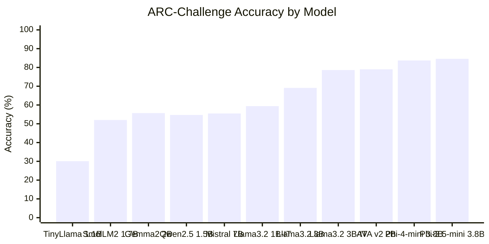
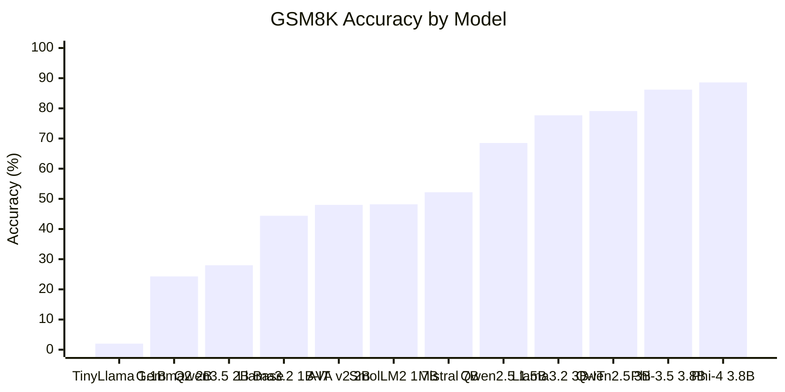

# AVA

AVA is a high-quality AI assistant built under extreme hardware constraints: a single **4 GB VRAM** laptop GPU (NVIDIA RTX A2000), no cloud budget, no large-cluster training. AVA v2 is a QLoRA fine-tune of Qwen3.5-2B that achieves **79% on ARC-Challenge** and **48% on GSM8K** while training and running inference in under 2 GB of VRAM.

The entire training pipeline, evaluation harness, and model weights are open. This README documents what was built, how it was built, and how to reproduce the results from scratch.

## Try AVA v2

### Option 1: Ollama (easiest — no Python needed)

Download a GGUF file from [Releases](https://github.com/NAME0x0/AVA/releases) or [HuggingFace](https://huggingface.co/NAME0x0/AVA-v2-GGUF), then:

```bash
ollama create ava-v2 -f Modelfile
ollama run ava-v2
```

Works on CPU, Apple Silicon, AMD GPUs, and NVIDIA GPUs. No Python environment required.

### Option 2: Python chat script

```bash
# Install
pip install -e .[bench]
pip install peft

# Chat (downloads from HuggingFace automatically)
python scripts/chat.py

# Single question
python scripts/chat.py --prompt "Explain why ice floats on water."

# Use a local adapter
python scripts/chat.py --adapter ./experiments/exp4_finetune/models/AVA-v2
```

### Option 3: Python API

```python
from transformers import AutoModelForCausalLM, AutoTokenizer, BitsAndBytesConfig
from peft import PeftModel
import torch

bnb_config = BitsAndBytesConfig(
    load_in_4bit=True, bnb_4bit_quant_type="nf4",
    bnb_4bit_compute_dtype=torch.bfloat16, bnb_4bit_use_double_quant=True,
)
model = AutoModelForCausalLM.from_pretrained(
    "Qwen/Qwen3.5-2B", quantization_config=bnb_config,
    device_map="auto", dtype=torch.bfloat16, attn_implementation="sdpa",
)
tokenizer = AutoTokenizer.from_pretrained("Qwen/Qwen3.5-2B")
model = PeftModel.from_pretrained(model, "NAME0x0/AVA-v2")
model = model.merge_and_unload()

messages = [{"role": "user", "content": "Explain why ice floats on water."}]
text = tokenizer.apply_chat_template(messages, tokenize=False, add_generation_prompt=True, enable_thinking=False)
inputs = tokenizer(text, return_tensors="pt").to(model.device)
output = model.generate(**inputs, max_new_tokens=512, temperature=0.7, do_sample=True)
print(tokenizer.decode(output[0][inputs["input_ids"].shape[1]:], skip_special_tokens=True))
```

Requires: Python 3.10+, NVIDIA GPU with 4+ GB VRAM, CUDA support.

## Results

### AVA v2 Benchmark Scores

| Benchmark | Qwen3.5-2B Base | AVA v1 (5K SFT) | AVA v2 (20K SFT) | Improvement vs Base |
|---|---|---|---|---|
| **ARC-Challenge** | 66.0% | 66.0% | **79.0%** | **+13.0pp** |
| **GSM8K** | 28.0% | 40.0% | **48.0%** | **+20.0pp** |

### Training Statistics

| Metric | AVA v1 | AVA v2 |
|---|---|---|
| Training corpus | 5,237 examples | 20,741 examples |
| Final train loss | 1.0185 | **0.4145** |
| Training time | 251 min | 100.5 min |
| Trainable parameters | 10,911,744 (0.58% of 1.89B) | 10,911,744 (0.58% of 1.89B) |
| Peak VRAM usage | 1.81 GB | 1.81 GB |
| Steps/second | 0.04 | 0.43 |
| Effective batch size | 8 | 8 |
| Learning rate | 2e-4 (cosine) | 1.5e-4 (cosine) |
| LoRA rank | 16 | 16 |
| LoRA alpha | 32 | 32 |
| Max sequence length | 384 tokens | 384 tokens |
| Epochs | 1 | 1 |

AVA v2 trained **10.7x faster** than v1 per step thanks to Triton kernel compilation for SDPA attention. The 4x larger corpus with augmented science and reasoning data was the key driver behind the ARC breakthrough (v1 showed zero ARC improvement over base).

### Comparison to Other Models

All scores from official model cards and technical reports. Evaluation protocols vary by source (shot count, prompting). AVA v2 scores are 0-shot.

#### ARC-Challenge (Science Reasoning)



#### GSM8K (Math Reasoning)



**Key takeaways:**

- AVA v2's **79% ARC-Challenge** at 2B parameters exceeds Llama 3.2 3B-Instruct (78.6% at 3B) and beats Mistral-7B (55.5% at 7B) by 23.5 percentage points
- On GSM8K, AVA v2 reaches 48% -- competitive with SmolLM2-1.7B-Instruct (48.2%) and ahead of Llama 3.2 1B-Instruct (44.4%)
- The ARC result is particularly notable because it was achieved with a 42 MB LoRA adapter, not a full model retrain

### Loss Curve

AVA v2 loss trajectory over 2,593 training steps:

```
Step     Loss     LR
  20     1.118    1.47e-5
 100     1.072    5.85e-5
 300     1.046    1.09e-4
 500     1.030    1.39e-4
 700     1.057    1.49e-4
1000     1.002    1.43e-4
1500     0.954    1.12e-4
2000     0.942    6.50e-5
2260     0.937    3.68e-5  <- all-time low
2500     0.971    5.17e-7
2593     0.414    0.00e+0  <- final (epoch average)
```

## Why This Matters

Most AI progress in 2025-2026 happens on clusters with hundreds or thousands of GPUs. AVA asks a different question: **what can you build with a single laptop GPU and no budget?**

The answer is more than most people expect:

- **79% ARC-Challenge at 2B params** beats Llama 3.2 3B-Instruct (78.6% at 3B) and Mistral 7B (55.5%) -- models that required orders of magnitude more compute to train
- The entire adapter is **42 MB**. The full training run uses **1.81 GB VRAM** and finishes in **100 minutes**
- Nothing here requires special hardware, cloud access, or corporate resources. Anyone with a modern laptop can reproduce these results

This matters because:

1. **Democratization is real, not theoretical.** Most "democratize AI" projects still require cloud GPUs. AVA trains and runs on hardware that students, researchers in developing countries, and hobbyists already own.

2. **Data quality dominates compute.** AVA v1 (5K examples) showed zero ARC improvement. AVA v2 (20K curated examples) jumped +13pp. The difference was not more compute -- it was better data. This validates the emerging consensus from Phi-4, LIMO, and DeepSeek that careful data curation can substitute for scale.

3. **QLoRA makes fine-tuning accessible.** Training 0.58% of parameters in 4-bit precision means a 2B model fits in under 2 GB. This opens a path where anyone can specialize a frontier-class base model for their domain without touching a cloud console.

4. **The research is reproducible.** Every script, corpus recipe, config file, and evaluation harness is in this repo. The model card has exact versions of every dependency. Run the scripts, get the numbers.

AVA is not trying to compete with GPT-4 or Claude. It is proving that meaningful AI capability -- strong science reasoning, solid math, reliable tool use -- can emerge from constraints that would have been considered impossible two years ago.

## How It Works

### Architecture

AVA v2 is a **QLoRA** (Quantized Low-Rank Adaptation) fine-tune of [Qwen/Qwen3.5-2B](https://huggingface.co/Qwen/Qwen3.5-2B):

- **Base model**: Qwen3.5-2B (1.89B parameters), loaded in 4-bit NF4 quantization via BitsAndBytes
- **Adapter**: LoRA rank 16, alpha 32, applied to all attention and MLP projections (`q_proj`, `k_proj`, `v_proj`, `o_proj`, `gate_proj`, `up_proj`, `down_proj`)
- **Trainable parameters**: 10.9M out of 1.89B total (0.58%)
- **Adapter size**: 42 MB (safetensors format)

### Training Data

The v2 corpus contains 20,741 prompt-response pairs across:

- Math reasoning (GSM8K-style step-by-step solutions)
- Science comprehension (ARC, SciQ, OpenBookQA-style)
- General instruction following
- Tool use and code generation
- Augmented with teacher-distilled examples for harder reasoning chains

### Hardware

- **GPU**: NVIDIA RTX A2000 Laptop (4 GB VRAM, Ampere GA107, compute capability 8.6)
- **Training VRAM**: 1.81 GB peak
- **Inference VRAM**: 1.74 GB
- All training, evaluation, and inference run on a single consumer laptop

## Reproducing the Results

### Prerequisites

- Python 3.10+
- NVIDIA GPU with CUDA support (4 GB+ VRAM)
- Visual Studio with C++ Build Tools (for Triton kernel compilation on Windows)

### Step 1: Install Dependencies

```bash
pip install torch torchvision torchaudio --index-url https://download.pytorch.org/whl/cu130
pip install transformers==5.3.0 peft==0.18.1 bitsandbytes==0.49.2 datasets accelerate
```

### Step 2: Install Triton (for SDPA kernel acceleration)

On Linux, Triton installs normally. On Windows:

```bash
pip install triton-windows==3.6.0.post26
```

Triton requires a C compiler. Set the `CC` environment variable to your MSVC `cl.exe` path:

```bash
# Find your cl.exe path (example for VS 2022/2026):
# C:\Program Files\Microsoft Visual Studio\18\Community\VC\Tools\MSVC\14.51.36014\bin\Hostx64\x64\cl.exe
set CC="C:\Program Files\Microsoft Visual Studio\18\Community\VC\Tools\MSVC\<version>\bin\Hostx64\x64\cl.exe"
```

### Step 3: Install Flash-Linear-Attention (optional, for Qwen3.5 fast path)

```bash
pip install flash-linear-attention==0.4.2
```

FLA requires `causal-conv1d`. On Windows, use the patched fork:

```bash
git clone https://github.com/sdbds/causal-conv1d-for-windows
cd causal-conv1d-for-windows
# Build with MSVC preprocessor fix and target your GPU arch:
pip install . --no-build-isolation
```

**Important**: When FLA is installed, you **must** set `attn_implementation="sdpa"` in `AutoModelForCausalLM.from_pretrained()` to avoid FLA's weight restructuring which is incompatible with BitsAndBytes 4-bit quantized weights.

### Step 4: Download the Base Model

```bash
# Download Qwen3.5-2B (or use huggingface_hub)
python -c "from transformers import AutoModelForCausalLM, AutoTokenizer; AutoTokenizer.from_pretrained('Qwen/Qwen3.5-2B'); AutoModelForCausalLM.from_pretrained('Qwen/Qwen3.5-2B')"
```

### Step 5: Prepare Training Data

The training corpus is a JSONL file with `prompt` and `response` fields:

```json
{"prompt": "What causes tides on Earth?", "response": "Tides are primarily caused by the gravitational pull of the Moon..."}
```

### Step 6: Train

```bash
python -u experiments/exp4_finetune/scripts/finetune_v2_full.py > training.log 2>&1
```

Key training configuration:

```python
# BitsAndBytes 4-bit quantization
BitsAndBytesConfig(
    load_in_4bit=True,
    bnb_4bit_quant_type="nf4",
    bnb_4bit_compute_dtype=torch.bfloat16,
    bnb_4bit_use_double_quant=True,
)

# Model loading (SDPA required when FLA is installed)
AutoModelForCausalLM.from_pretrained(
    model_path,
    quantization_config=bnb_config,
    device_map="auto",
    dtype=torch.bfloat16,
    attn_implementation="sdpa",
)

# Training arguments
TrainingArguments(
    per_device_train_batch_size=1,
    gradient_accumulation_steps=8,
    learning_rate=1.5e-4,
    lr_scheduler_type="cosine",
    bf16=True,
    gradient_checkpointing=True,
    optim="paged_adamw_8bit",
    eval_strategy="no",  # Eval OOMs on 4GB VRAM (248K vocab)
)
```

### Step 7: Benchmark

```bash
python -u experiments/exp4_finetune/scripts/benchmark_full.py \
    --adapter experiments/exp4_finetune/models/Qwen3.5-2B-AVA-v2 \
    --arc-limit 100 --gsm8k-limit 50
```

## Lessons Learned

### What worked

1. **QLoRA over scratch training**: Our previous 14M scratch model hit 24% ARC and 0% GSM8K. Fine-tuning a 2B model immediately reached 66%/28% baseline, then 79%/48% after SFT.
2. **Corpus scale matters more than epochs**: v1 (5K examples, 1 epoch) showed no ARC improvement. v2 (20K examples, 1 epoch) jumped +13pp. More diverse data beat repeated passes.
3. **Triton kernel compilation**: Installing Triton on Windows for SDPA attention kernels gave a 10.7x speedup (25s/step to 5.8s/step), making the full 20K corpus trainable in 100 minutes.
4. **Checkpoint resume**: HuggingFace Trainer's checkpoint resume saved hours of work across laptop cooldown breaks and crashes.

### What didn't work

1. **FLA with BitsAndBytes**: Flash-Linear-Attention tries to restructure attention weights (merging q/k/v into combined projections) which crashes on BnB 4-bit quantized tensors. Workaround: force SDPA mode.
2. **Inline evaluation**: The 248K vocabulary of Qwen3.5 means `logits.float()` during eval OOMs on 4 GB. Evaluation must run as a separate step after training.
3. **Unsloth on Windows**: Unsloth's fast kernels require Linux. We used vanilla HuggingFace Trainer with manual freeze and gradient checkpointing instead.

### Windows-specific issues

- **Triton C compiler**: Triton needs `CC` env var pointing to MSVC `cl.exe`. The bundled TinyCC fallback doesn't work reliably.
- **causal-conv1d**: Requires a [patched Windows fork](https://github.com/sdbds/causal-conv1d-for-windows) with `/Zc:preprocessor` MSVC flag.
- **Output buffering**: Python on Windows buffers stdout when redirecting to files. Use `python -u` for real-time training logs.
- **expandable_segments**: `PYTORCH_CUDA_ALLOC_CONF=expandable_segments:True` is not supported on Windows but doesn't cause errors (just a warning).

## Model Weights

### GGUF for Ollama / llama.cpp

Pre-built GGUF files are available from [GitHub Releases](https://github.com/NAME0x0/AVA/releases) and [HuggingFace](https://huggingface.co/NAME0x0/AVA-v2-GGUF).

| File | Quantization | Size | Quality |
|---|---|---|---|
| AVA-v2-Q4_K_M.gguf | Q4_K_M | ~1.5 GB | Recommended — best size/quality balance |
| AVA-v2-Q8_0.gguf | Q8_0 | ~2.0 GB | Near-lossless |

To build GGUF locally:

```bash
# Merge adapter and save merged model
python scripts/convert_to_gguf.py --merge-only

# Full pipeline (requires llama.cpp):
git clone https://github.com/ggerganov/llama.cpp
cd llama.cpp && cmake -B build && cmake --build build --config Release -j$(nproc) && cd ..
python scripts/convert_to_gguf.py --llama-cpp ./llama.cpp --quants Q4_K_M Q8_0

# Use with Ollama:
ollama create ava-v2 -f Modelfile
ollama run ava-v2
```

The GGUF build also runs automatically in CI — trigger it from Actions or publish a GitHub Release.

### LoRA Adapter (42 MB)

Available on HuggingFace: [NAME0x0/AVA-v2](https://huggingface.co/NAME0x0/AVA-v2)

The adapter is also stored in this repo in standard PEFT format:

```
experiments/exp4_finetune/models/AVA-v2/
  adapter_config.json       # LoRA configuration
  adapter_model.safetensors # 42 MB adapter weights (Git LFS)
  tokenizer.json            # Qwen3.5 tokenizer (Git LFS)
  tokenizer_config.json
  training_report.json      # Training metrics
  README.md                 # HuggingFace model card
```

## Software Stack

| Component | Version | Purpose |
|---|---|---|
| Python | 3.13 | Runtime |
| PyTorch | 2.10.0+cu130 | Tensor computation |
| Transformers | 5.3.0 | Model loading, Trainer |
| PEFT | 0.18.1 | LoRA adapter management |
| BitsAndBytes | 0.49.2 | 4-bit NF4 quantization |
| Triton (Windows) | 3.6.0.post26 | GPU kernel compilation |
| Flash-Linear-Attention | 0.4.2 | Qwen3.5 attention backend |
| causal-conv1d | 1.5.0.post8 | FLA dependency (Windows fork) |
| Datasets | latest | HuggingFace dataset handling |
| Accelerate | latest | Device placement |

## Repository Layout

```
AVA/
├── src/ava/                    # Core research library (installed as `ava` package)
│   ├── model.py                #   AVA v3 scratch model (14M param GPT-2 variant)
│   ├── train.py                #   Training loop for scratch models
│   ├── rl.py                   #   Verifiable reinforcement learning (REINFORCE)
│   ├── config.py               #   Experiment config loader (YAML-based)
│   ├── cli.py                  #   CLI entry point (`python -m ava.cli`)
│   ├── external_benchmarks.py  #   ARC-Challenge, GSM8K, PIQA evaluation harness
│   ├── corpus_recipes.py       #   Corpus materialization from HuggingFace datasets
│   ├── retrieval.py            #   Sparse retrieval for support-bank ensembles
│   ├── dense_retrieval.py      #   Dense (embedding-based) retrieval
│   ├── memory.py               #   External memory with surprise-gated writes
│   ├── tokenizer.py            #   Byte-level tokenizer + HF tokenizer imports
│   └── ...                     #   Sessions, activity logging, tools, inspection
│
├── experiments/
│   └── exp4_finetune/          # Experiment 4: QLoRA fine-tuning (current focus)
│       ├── scripts/            #   Training, benchmarking, corpus building scripts
│       │   ├── finetune_v2_full.py     # AVA v2 training script
│       │   ├── benchmark_full.py       # ARC + GSM8K evaluation
│       │   ├── upload_to_hf.py         # Push adapter to HuggingFace
│       │   └── ...                     # Corpus builders, older experiment scripts
│       ├── models/AVA-v2/      #   Released adapter weights (42 MB)
│       └── results/            #   Pipeline state and evaluation outputs
│
├── scripts/
│   ├── chat.py                 # Interactive chat with AVA v2
│   ├── convert_to_gguf.py      # Merge adapter + convert to GGUF for Ollama
│   └── generate_*.py           # Corpus generation utilities
│
├── Modelfile                   # Ollama model definition (use with GGUF)
│
├── configs/
│   ├── base.yaml               # Base model configuration
│   └── experiments/            # YAML configs for each experiment variant
│
├── corpora/                    # Training corpora (JSONL format)
│   ├── ava_v2_*/               #   v2 fine-tuning data (open mix, post-train, repair)
│   └── ava_v3_*/               #   v3 scratch training data
│
├── sessions/                   # Experiment tracking (timestamped packets)
│   ├── YYYY-MM-DD-*/           #   Session directories with notes, metrics, configs
│   └── activity/               #   CLI command logs and benchmark result JSONs
│
├── docs/                       # Research documentation
│   ├── ARCHITECTURE.md         #   System architecture and module design
│   └── RESEARCH_ROADMAP.md     #   arXiv paper survey mapped to AVA experiments
│
├── tests/                      # Test suite (pytest)
│   ├── test_model.py           #   Model architecture tests
│   ├── test_train.py           #   Training pipeline tests
│   ├── test_experiments.py     #   Experiment config validation
│   ├── test_external_benchmarks.py  # Benchmark harness tests
│   └── ...                     #   Retrieval, memory, tokenizer, corpus tests
│
├── .github/workflows/ci.yml   # CI: lint, test, adapter integrity checks
└── .github/workflows/gguf.yml # CI: build GGUF, quantize, upload to HF + releases
```

## Roadmap

AVA is a research project exploring how far a single-GPU setup can push AI capability. The roadmap reflects real constraints: everything must train and run on 4 GB VRAM.

### Completed

- [x] Scratch-trained 14M model (experiments 1-3): established baselines, proved architectural ideas
- [x] QLoRA fine-tuning pipeline on Qwen3.5-2B (experiment 4)
- [x] AVA v2: 79% ARC-Challenge, 48% GSM8K with 20K curated examples
- [x] Sparse retrieval ensemble for science reasoning (91/299 ARC with support banks)
- [x] Full reproducibility: open weights, open data, open code

### In Progress

- [ ] Extended sequence length training (384 -> 1024+ tokens) for longer reasoning chains
- [ ] Post-training with verifiable RL (math and science verification rewards)
- [ ] Improved GSM8K through chain-of-thought curriculum

### Planned

- [ ] DPO/RLHF alignment for instruction following quality
- [ ] Tool use specialization (calculator, code interpreter)
- [ ] Multimodal extension via compact vision encoder (following Penguin-VL approach)
- [ ] Structured external memory for continual learning
- [ ] Multi-benchmark evaluation: MMLU, HumanEval, TruthfulQA
- [ ] Model distillation: compress AVA gains into a smaller student

### Long-Term Vision

- [ ] A general-purpose assistant that runs entirely on consumer hardware
- [ ] Multilingual support starting with Urdu and Arabic
- [ ] On-device deployment (mobile/edge) through further quantization
- [ ] Community-driven corpus contributions and benchmark extensions

## Prior Work

AVA's earlier experiments (v3 scratch-trained architecture) are preserved in the repo:

- A compact 11M checkpoint with strong internal tool/compliance behavior
- A memory-transfer system achieving 87/87 on stress suites
- A science-first sparse retrieval ensemble reaching 91/299 on ARC-Challenge
- Tokenizer research showing Qwen's tokenizer compresses AVA data at 0.24x byte ratio

These experiments informed the pivot to fine-tuning: the scratch model's 24% ARC ceiling made it clear that parameter count and pre-trained knowledge matter more than architectural cleverness at this scale.

## Quick Start

```bash
# Install
python -m pip install -e .[dev,bench]

# Run tests
python -m pytest tests/ -q

# Chat with AVA v2
python scripts/chat.py

# Run benchmarks
python -u experiments/exp4_finetune/scripts/benchmark_full.py \
    --adapter experiments/exp4_finetune/models/Qwen3.5-2B-AVA-v2
```

## License

This project is open source. The AVA v2 adapter weights are released under the same license as the base model ([Qwen License](https://huggingface.co/Qwen/Qwen3.5-2B/blob/main/LICENSE)).

## Citation

```bibtex
@misc{ava-v2-2026,
  title={AVA v2: QLoRA Fine-tuning Under Extreme VRAM Constraints},
  author={Muhammad Afsah Mumtaz},
  year={2026},
  url={https://github.com/NAME0x0/AVA}
}
```
