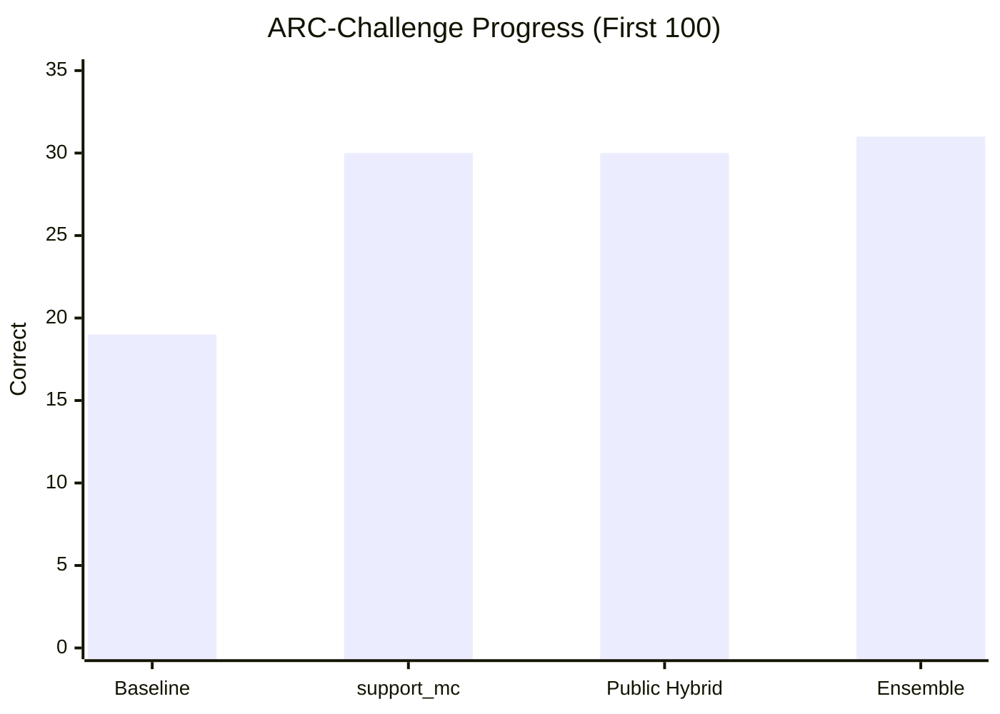
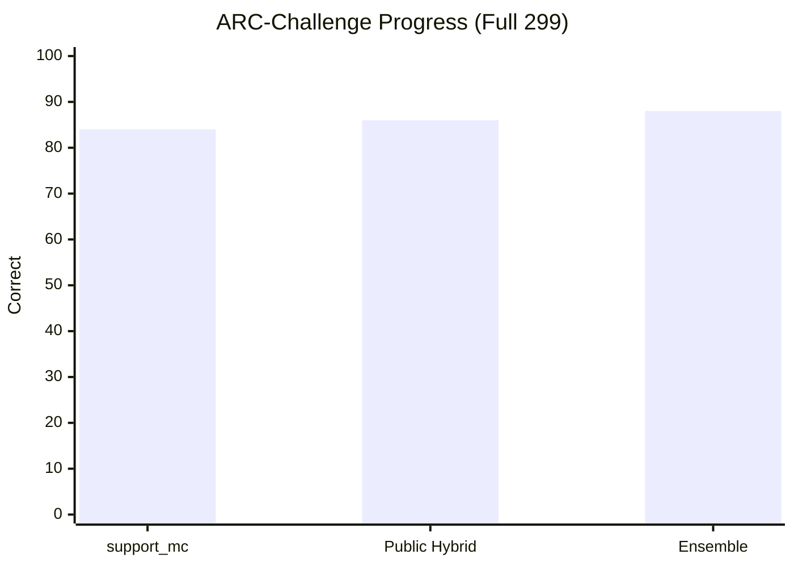
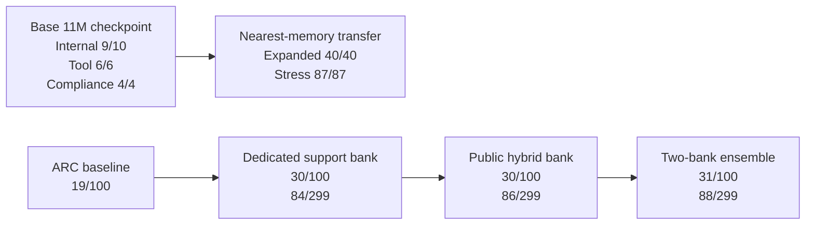

# AVA

AVA is a transparent small-model research stack for building a high-quality assistant under hard constraints: one 4 GB VRAM GPU, limited data, limited time, and no large-cluster budget.

The repo contains the model code, training loop, tokenizers, corpora, benchmark runners, retrieval system, inspection tools, activity ledger, and session notes used to build AVA. The goal is not to mimic frontier labs with brute force. The goal is to find a compact path that wins through better data, better systems design, tighter evaluation, and disciplined experimentation.

## Current Status

As of March 15, 2026, AVA has four live stories:

- a compact `11M` checkpoint with strong internal tool/compliance behavior
- a small-memory transfer path that turns that checkpoint into a much stronger hybrid system on held-out internal suites
- a real public benchmark lift on `ARC-Challenge`
- a new best public path through margin-gated support-bank ensembling

### Scoreboard

| Track | Result | Source |
| --- | --- | --- |
| Base checkpoint internal benchmark | `9/10` | [failure-patch-v2 rerun](/D:/AVA/sessions/2026-03-14-184859-failure-patch-v2-rerun-11m-96/notes.md) |
| Base checkpoint tool eval | `6/6` | [failure-patch-v2 rerun](/D:/AVA/sessions/2026-03-14-184859-failure-patch-v2-rerun-11m-96/notes.md) |
| Base checkpoint compliance | `4/4` | [failure-patch-v2 rerun](/D:/AVA/sessions/2026-03-14-184859-failure-patch-v2-rerun-11m-96/notes.md) |
| Expanded internal transfer suite with `23`-example memory bank | `40/40` | [expanded-transfer-tool-repair-nano-v1](/D:/AVA/sessions/2026-03-14-202119-expanded-transfer-tool-repair-nano-v1/notes.md) |
| Stress transfer suite with `21`-example memory bank | `87/87` | [stress-tool-minimal-v3-rerun](/D:/AVA/sessions/2026-03-14-202211-stress-tool-minimal-v3-rerun/notes.md) |
| Same stress suite without memory | `17/87` | [stress-tool-minimal-v3-rerun](/D:/AVA/sessions/2026-03-14-202211-stress-tool-minimal-v3-rerun/notes.md) |
| ARC-Challenge baseline, first `100` | `19/100` | [arc-baseline-100-v3.json](/D:/AVA/sessions/activity/arc-baseline-100-v3.json) |
| ARC-Challenge with dedicated `support_mc`, first `100` | `30/100` | [arc-support-mc-100-kindscience.json](/D:/AVA/sessions/activity/arc-support-mc-100-kindscience.json) |
| ARC-Challenge with dedicated `support_mc`, full `299` | `84/299` | [arc-support-mc-299-kindscience.json](/D:/AVA/sessions/activity/arc-support-mc-299-kindscience.json) |
| ARC-Challenge with tuned public hybrid bank, first `100` | `30/100` | [summary.json](/D:/AVA/sessions/2026-03-15-160500-hybrid-public-benchmark-rag-v1/results/summary.json) |
| ARC-Challenge with tuned public hybrid bank, full `299` | `86/299` | [summary.json](/D:/AVA/sessions/2026-03-15-160500-hybrid-public-benchmark-rag-v1/results/summary.json) |
| ARC-Challenge with margin-gated two-bank ensemble, first `100` | `31/100` | [notes.md](/D:/AVA/sessions/2026-03-15-160500-hybrid-public-benchmark-rag-v1/notes.md) |
| ARC-Challenge with margin-gated two-bank ensemble, full `299` | `88/299` | [notes.md](/D:/AVA/sessions/2026-03-15-160500-hybrid-public-benchmark-rag-v1/notes.md) |
| GSM8K baseline, first `50` | `0/50` | [gsm8k-baseline-50-v2.json](/D:/AVA/sessions/activity/gsm8k-baseline-50-v2.json) |
| GSM8K nearest retrieval on cleaned math support, first `50` | `0/50` | [notes.md](/D:/AVA/sessions/2026-03-15-160500-hybrid-public-benchmark-rag-v1/notes.md) |

### ARC Progress







## What Changed Most Recently

The newest branch is captured in [notes.md](/D:/AVA/sessions/2026-03-15-160500-hybrid-public-benchmark-rag-v1/notes.md).

What worked:

- explicit support-bank `category` preservation in [retrieval.py](/D:/AVA/src/ava/retrieval.py) fixed a real mixed-bank routing bug
- reusable sparse support indexing in [external_benchmarks.py](/D:/AVA/src/ava/external_benchmarks.py) made larger public support banks usable again
- keeping rotated ARC support rows materially improved the public bank
- a question/semantic-heavy hybrid scorer improved the broad public ARC bank
- a margin-gated two-bank ensemble over [public_benchmark_distill_v1](/D:/AVA/corpora/public_benchmark_distill_v1) and [arc_train_support_v1](/D:/AVA/corpora/arc_train_support_v1) produced the new best `88/299`

What did not work:

- GSM8K stayed at `0/50` under the retrieval variants tried so far
- adding teacher science anchors on top of the public bank did not improve ARC
- PIQA is currently blocked by the local `datasets` runtime path rather than model inference quality

The current lesson is simple: public science MCQ is moving through better retrieval systems faster than through naive weight surgery.

## What AVA Is

AVA is the product. This codebase is the machinery used to build it.

The active stack is currently text-first and focused on:

- language
- math
- science
- coding
- tool use
- compliance and instruction following
- planning and memory scaffolding
- multilingual and multimodal evaluation scaffolding

## Repository Layout

- `src/ava/` - model code, tokenizers, training loop, evaluation, sessions, tools, memory, retrieval, inspection, and public benchmark runners
- `configs/` - experiment configs, tokenizer configs, and support-bank manifests
- `corpora/` - tracked corpora and support banks
- `docs/` - architecture, data, benchmark, experiment, and roadmap notes
- `sessions/` - experiment packets, metrics, notes, and activity logs
- `tests/` - regression and validation coverage for the research core

## Quick Start

Install the package plus dev and benchmark extras:

```bash
python -m pip install -e .[dev,bench]
```

Add training dependencies when needed:

```bash
python -m pip install -e .[train]
```

Run the baseline budget check:

```bash
ava train dry-run configs/base.yaml
```

Run the current benchmark registry smoke:

```bash
ava benchmark registry --stage foundation
ava benchmark registry --modality vision
```

Replay the current best public ARC path:

```bash
ava benchmark external arc-challenge sessions/2026-03-14-184859-failure-patch-v2-rerun-11m-96/checkpoints/ava-11m-failure-patch-v2.pt --limit 299 --device cuda --retrieval-mode hybrid_support_ensemble --support-corpus configs/support/arc_ensemble_public_primary_v1.json
```

Replay the current best internal transfer path:

```bash
ava session memory-transfer stress-tool-minimal-v3-rerun sessions/2026-03-14-184859-failure-patch-v2-rerun-11m-96/checkpoints/ava-11m-failure-patch-v2.pt corpora/tool_memory_minimal_v3 --device cuda --nearest-threshold 0.45 --nearest-margin 0.0 --suite stress
```

Archive a test run in the activity ledger:

```bash
ava activity run -- python -m pytest -q
```

## Experiment Discipline

AVA is session-first. Meaningful work is recorded under `sessions/` with:

- config snapshots
- corpus manifests
- environment metadata
- training curves and evaluation outputs
- checkpoint or support-bank artifacts
- written notes and explicit next-step decisions

There should be no silent fallbacks, no hidden benchmark state, and no untraceable “magic improvement.”

## CI / CD

The repository now treats CI as part of the research contract.

Current CI in [.github/workflows/ci.yml](/D:/AVA/.github/workflows/ci.yml) runs:

- Python matrix quality checks on `3.10` and `3.11`
- `ruff check`
- `ruff format --check`
- `mypy src tests`
- `pytest -q`
- CLI smoke checks for `train dry-run` and benchmark registry commands

That keeps the model stack, benchmark surface, and docs/install path from drifting silently.

## Transparency

Transparency is a design constraint, not a nice-to-have.

Every serious experiment should leave behind enough evidence to answer:

- what changed
- why it changed
- what was run
- what improved
- what failed
- what should happen next

For command-level provenance, AVA keeps an append-only activity ledger under `sessions/activity/`.

## Further Reading

- [Architecture](docs/ARCHITECTURE.md)
- [Benchmarks](docs/BENCHMARKS.md)
- [Data Strategy](docs/DATA.md)
- [Experiment Workflow](docs/EXPERIMENTS.md)
- [Research Roadmap](docs/RESEARCH_ROADMAP.md)
- [Teacher Distillation SOP](docs/TEACHER_DISTILLATION_SOP.md)

## Status

AVA is still in active experimentation. The current best honest story is not “tiny model beats everything.” The current best honest story is stronger than that: a transparent compact checkpoint plus well-shaped external support already produces strong internal control and a measured public benchmark lift, and the repo makes the wins, failures, and tradeoffs inspectable end to end.
