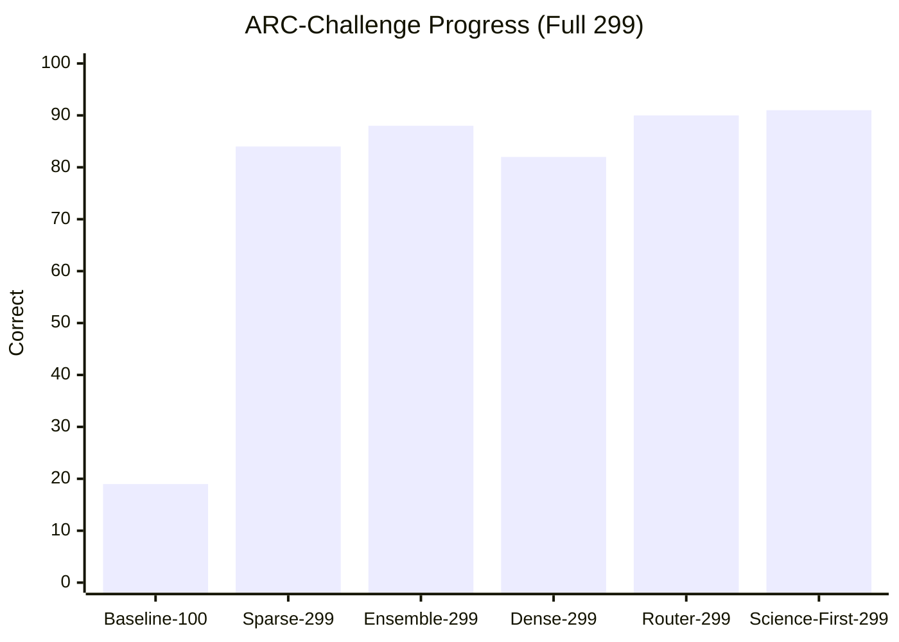
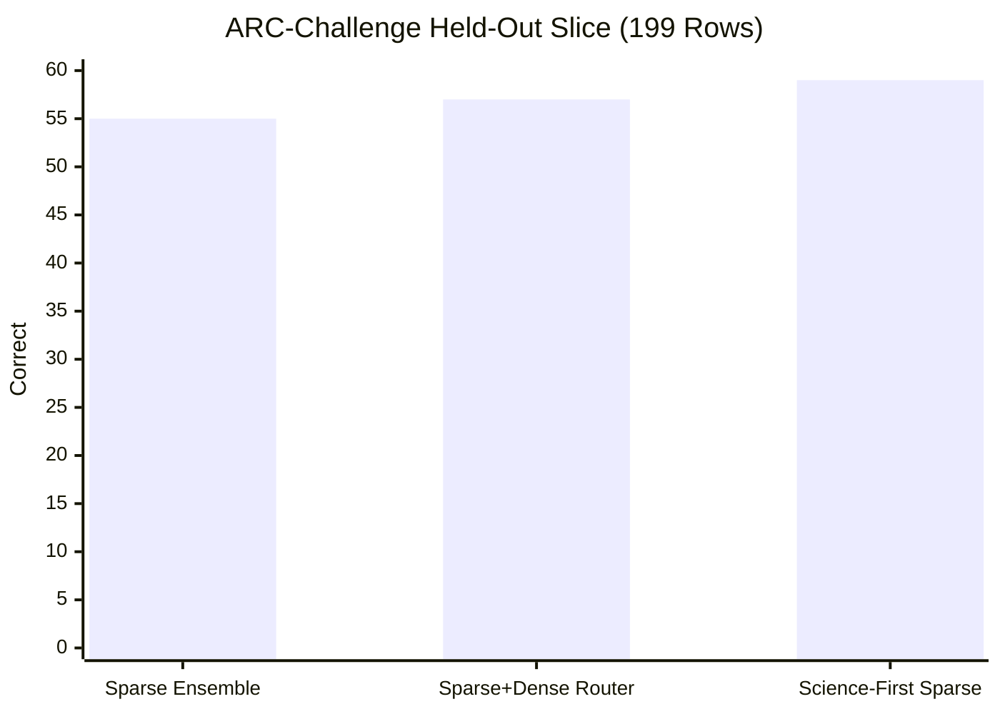
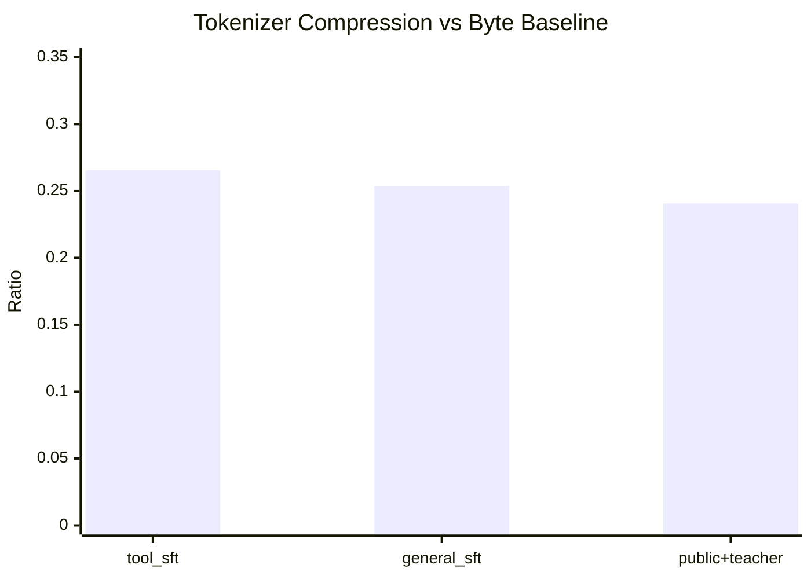
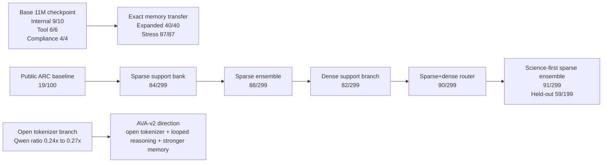

# AVA

AVA is a transparent small-model research stack for building a high-quality assistant under hard constraints: one 4 GB VRAM GPU, limited data, limited time, and no large-cluster budget.

The repo contains the model code, training loop, tokenizers, corpora, benchmark runners, retrieval system, inspection tools, activity ledger, and session notes used to build AVA. The goal is not to mimic frontier labs with brute force. The goal is to find a compact path that wins through better data, better systems design, tighter evaluation, and disciplined experimentation.

## Current Status

As of March 16, 2026, AVA has six live stories:

- a compact `11M` checkpoint with strong internal tool/compliance behavior
- a small-memory transfer path that turns that checkpoint into a much stronger hybrid system on held-out internal suites
- a real public benchmark lift on `ARC-Challenge`
- a science-first sparse retrieval ensemble that is now the best verified public result in the repo
- a tokenizer branch that shows open-model tokenization can compress AVA's data sharply
- an AVA-v2 research direction centered on better tokenization, recurrent/looped reasoning, and stronger non-parametric memory instead of more blind weight patches

### Scoreboard

| Track | Result | Source |
| --- | --- | --- |
| Base checkpoint internal benchmark | `9/10` | [failure-patch-v2 rerun](/D:/AVA/sessions/2026-03-14-184859-failure-patch-v2-rerun-11m-96/notes.md) |
| Base checkpoint tool eval | `6/6` | [failure-patch-v2 rerun](/D:/AVA/sessions/2026-03-14-184859-failure-patch-v2-rerun-11m-96/notes.md) |
| Base checkpoint compliance | `4/4` | [failure-patch-v2 rerun](/D:/AVA/sessions/2026-03-14-184859-failure-patch-v2-rerun-11m-96/notes.md) |
| Expanded internal transfer suite with `23`-example memory bank | `40/40` | [expanded-transfer-tool-repair-nano-v1](/D:/AVA/sessions/2026-03-14-202119-expanded-transfer-tool-repair-nano-v1/notes.md) |
| Stress transfer suite with `21`-example memory bank | `87/87` | [stress-tool-minimal-v3-rerun](/D:/AVA/sessions/2026-03-14-202211-stress-tool-minimal-v3-rerun/notes.md) |
| Same stress suite without memory | `17/87` | [stress-tool-minimal-v3-rerun](/D:/AVA/sessions/2026-03-14-202211-stress-tool-minimal-v3-rerun/notes.md) |
| ARC-Challenge baseline, first `100` | `19/100` | [arc-baseline-100-v3.json](/D:/AVA/sessions/activity/arc-baseline-100-v3.json) |
| ARC-Challenge sparse support, first `100` | `30/100` | [arc-support-mc-100-kindscience.json](/D:/AVA/sessions/activity/arc-support-mc-100-kindscience.json) |
| ARC-Challenge sparse support, full `299` | `84/299` | [arc-support-mc-299-kindscience.json](/D:/AVA/sessions/activity/arc-support-mc-299-kindscience.json) |
| ARC-Challenge tuned sparse ensemble, full `299` | `88/299` | [arc-hybrid-support-ensemble-299-v1.json](/D:/AVA/sessions/activity/arc-hybrid-support-ensemble-299-v1.json) |
| ARC-Challenge dense hybrid with `BAAI/bge-m3`, first `100` | `32/100` | [arc-dense-bgem3-100.json](/D:/AVA/sessions/activity/arc-dense-bgem3-100.json) |
| ARC-Challenge dense hybrid with `BAAI/bge-m3`, full `299` | `82/299` | [arc-dense-bgem3-299.json](/D:/AVA/sessions/activity/arc-dense-bgem3-299.json) |
| ARC-Challenge sparse+dense router, full `299` | `90/299` | [arc-router-bgem3-299.json](/D:/AVA/sessions/activity/arc-router-bgem3-299.json) |
| ARC-Challenge sparse+dense router, held-out `199` | `57/199` | [arc-router-bgem3-test199.json](/D:/AVA/sessions/activity/arc-router-bgem3-test199.json) |
| ARC-Challenge science-primary sparse ensemble, first `100` | `32/100` | [arc-ensemble-science-public-arc-100-v1.json](/D:/AVA/sessions/activity/arc-ensemble-science-public-arc-100-v1.json) |
| ARC-Challenge science-primary sparse ensemble, full `299` | `91/299` | [arc-ensemble-science-public-arc-299-v1.json](/D:/AVA/sessions/activity/arc-ensemble-science-public-arc-299-v1.json) |
| ARC-Challenge science-primary sparse ensemble, held-out `199` | `59/199` | [arc-ensemble-science-public-arc-test199-v1.json](/D:/AVA/sessions/activity/arc-ensemble-science-public-arc-test199-v1.json) |
| GSM8K baseline, first `50` | `0/50` | [gsm8k-baseline-50-v2.json](/D:/AVA/sessions/activity/gsm8k-baseline-50-v2.json) |
| GSM8K retrieval variants, first `50` | `0/50` | [hybrid-public-benchmark-rag-v1](/D:/AVA/sessions/2026-03-15-160500-hybrid-public-benchmark-rag-v1/notes.md) |
| Qwen tokenizer compression on `public_benchmark_plus_teacher_v1` | `0.2407x` byte tokens | [2026-03-15.jsonl](/D:/AVA/sessions/activity/2026-03-15.jsonl) |
| Qwen tokenizer compression on `general_sft` | `0.2537x` byte tokens | [2026-03-15.jsonl](/D:/AVA/sessions/activity/2026-03-15.jsonl) |
| Qwen tokenizer compression on `tool_sft` | `0.2656x` byte tokens | [2026-03-15.jsonl](/D:/AVA/sessions/activity/2026-03-15.jsonl) |

### Public ARC Progress









## What Changed Most Recently

The newest measured public breakthrough is the science-first sparse ARC ensemble:

- a real public-science bank from SciQ and OpenBookQA adds useful coverage, but the main gain came from routing discipline rather than just more rows
- making `science` the primary sparse bank while keeping `public` and `arc` as fallback banks beat the previous sparse+dense mainline
- the new best verified public result is [arc-ensemble-science-public-arc-299-v1.json](/D:/AVA/sessions/activity/arc-ensemble-science-public-arc-299-v1.json) at `91/299`
- the held-out ARC slice also improved to [arc-ensemble-science-public-arc-test199-v1.json](/D:/AVA/sessions/activity/arc-ensemble-science-public-arc-test199-v1.json) at `59/199`
- the full experimental packet is [public-science-ensemble-v1](/D:/AVA/sessions/2026-03-15-223240-public-science-ensemble-v1/notes.md)

The newest architecture lesson is separate from that benchmark win:

- open tokenizers from strong open models compress AVA's actual corpora far better than the byte baseline
- `Qwen/Qwen2.5-0.5B` is the strongest tokenizer tested so far on AVA data
- late tokenizer migration into the current byte-trained checkpoint still collapses behavior, so tokenizer improvement belongs in AVA-v2 rather than as a last-minute transplant

The repo is now converging on a cleaner technical story:

- current AVA mainline: compact checkpoint + transparent external memory/retrieval, with science-first sparse routing as the strongest public ARC path
- AVA-v2 direction: better open tokenizer, stronger retrieval/memory, and a more principled looped/recurrent architecture instead of more ad hoc patch tuning

## What AVA Is

AVA is the product. This codebase is the machinery used to build it.

The active stack is currently text-first and focused on:

- language
- math
- science
- coding
- tool use
- compliance and instruction following
- planning and memory scaffolding
- multilingual and multimodal evaluation scaffolding

## Repository Layout

- `src/ava/` - model code, tokenizers, training loop, evaluation, sessions, tools, memory, retrieval, inspection, and public benchmark runners
- `configs/` - experiment configs, tokenizer configs, and support-bank manifests
- `corpora/` - tracked corpora and support banks
- `docs/` - architecture, data, benchmark, experiment, and roadmap notes
- `sessions/` - experiment packets, metrics, notes, and activity logs
- `tests/` - regression and validation coverage for the research core

## Quick Start

Install the package plus dev and benchmark extras:

```bash
python -m pip install -e .[dev,bench]
```

Add training dependencies when needed:

```bash
python -m pip install -e .[train]
```

Run the baseline budget check:

```bash
ava train dry-run configs/base.yaml
```

Run the benchmark registry smoke:

```bash
ava benchmark registry --stage foundation
ava benchmark registry --modality vision
```

Replay the current best public ARC path:

```bash
ava benchmark external arc-challenge sessions/2026-03-14-184859-failure-patch-v2-rerun-11m-96/checkpoints/ava-11m-failure-patch-v2.pt --limit 299 --device cuda --retrieval-mode hybrid_support_ensemble --support-corpus configs/support/arc_ensemble_science_public_arc_v1.json
```

Replay the current best internal transfer path:

```bash
ava session memory-transfer stress-tool-minimal-v3-rerun sessions/2026-03-14-184859-failure-patch-v2-rerun-11m-96/checkpoints/ava-11m-failure-patch-v2.pt corpora/tool_memory_minimal_v3 --device cuda --nearest-threshold 0.45 --nearest-margin 0.0 --suite stress
```

Archive a test run in the activity ledger:

```bash
ava activity run -- python -m pytest -q --basetemp .pytest-tmp
```

## Experiment Discipline

AVA is session-first. Meaningful work is recorded under `sessions/` with:

- config snapshots
- corpus manifests
- environment metadata
- training curves and evaluation outputs
- checkpoint or support-bank artifacts
- written notes and explicit next-step decisions

There should be no silent fallbacks, no hidden benchmark state, and no untraceable magic improvement.

## CI / CD

CI is part of the research contract.

Current CI in [.github/workflows/ci.yml](/D:/AVA/.github/workflows/ci.yml) now checks three different failure surfaces:

- `quality` on Linux across Python `3.10`, `3.11`, and `3.13`
- a full Linux research-core job with `dev + train + bench` extras and the full `pytest` suite
- a Windows smoke job with the core env/retrieval tests and CLI benchmark smoke so local path and temp handling do not drift away from the user's real environment

The workflow also forces `pytest` into a repo-local temp directory so Windows runs do not silently fail on global temp permission issues.

## Transparency

Transparency is a design constraint, not a nice-to-have.

Every serious experiment should leave behind enough evidence to answer:

- what changed
- why it changed
- what was run
- what improved
- what failed
- what should happen next

For command-level provenance, AVA keeps an append-only activity ledger under `sessions/activity/`.

## Further Reading

- [Architecture](docs/ARCHITECTURE.md)
- [Benchmarks](docs/BENCHMARKS.md)
- [Data Strategy](docs/DATA.md)
- [Experiment Workflow](docs/EXPERIMENTS.md)
- [Research Roadmap](docs/RESEARCH_ROADMAP.md)
- [Teacher Distillation SOP](docs/TEACHER_DISTILLATION_SOP.md)

## Status

AVA is still in active experimentation. The best honest story today is not tiny model beats everything. The best honest story is stronger and more useful than that: a transparent compact checkpoint plus well-shaped external memory already produces strong internal control, the public ARC benchmark is still moving through measured retrieval-system improvements, and the next serious leap looks architectural rather than cosmetic.
