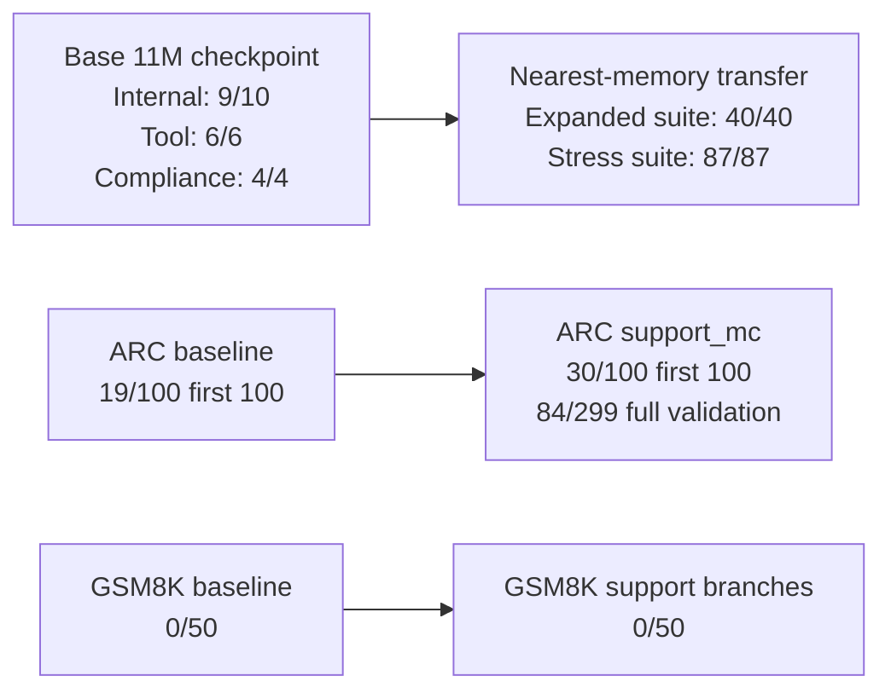
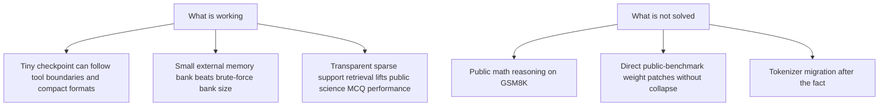

# AVA

AVA is a compact AI model project built under hard constraints: one 4 GB VRAM GPU, limited data, and no large-cluster research budget.

This repository is the engineering and experimentation stack behind AVA. It is where the model, training loop, tokenizers, corpora, evaluation harnesses, benchmark runners, and transparent session logs live. The goal is not to imitate frontier labs with brute force. The goal is to find a small-model path that wins through better data, tighter experiments, stronger tool use, and a more transparent training process.

## Current Progress

As of March 15, 2026, AVA has three distinct live results:

- base `11M` checkpoint with strong internal behavior and clean tool/compliance control
- memory-assisted transfer path that turns the same tiny checkpoint into a much stronger system on held-out internal suites
- first real public-benchmark gain on `ARC-Challenge` through transparent sparse support retrieval

### Scoreboard

| Track | Result | Source |
| --- | --- | --- |
| Base checkpoint internal benchmark | `9/10` | [failure-patch-v2 rerun](/D:/AVA/sessions/2026-03-14-184859-failure-patch-v2-rerun-11m-96/notes.md) |
| Base checkpoint tool eval | `6/6` | [failure-patch-v2 rerun](/D:/AVA/sessions/2026-03-14-184859-failure-patch-v2-rerun-11m-96/notes.md) |
| Base checkpoint compliance | `4/4` | [failure-patch-v2 rerun](/D:/AVA/sessions/2026-03-14-184859-failure-patch-v2-rerun-11m-96/notes.md) |
| Expanded transfer suite with `23`-example memory bank | `40/40` | [expanded-transfer-tool-repair-nano-v1](/D:/AVA/sessions/2026-03-14-202119-expanded-transfer-tool-repair-nano-v1/notes.md) |
| Stress transfer suite with `21`-example memory bank | `87/87` | [stress-tool-minimal-v3-rerun](/D:/AVA/sessions/2026-03-14-202211-stress-tool-minimal-v3-rerun/notes.md) |
| Same stress suite without memory | `17/87` | [stress-tool-minimal-v3-rerun](/D:/AVA/sessions/2026-03-14-202211-stress-tool-minimal-v3-rerun/notes.md) |
| ARC-Challenge first `100` baseline | `19/100` | [arc-baseline-100-v3.json](/D:/AVA/sessions/activity/arc-baseline-100-v3.json) |
| ARC-Challenge first `100` with `support_mc` | `30/100` | [arc-support-mc-100-kindscience.json](/D:/AVA/sessions/activity/arc-support-mc-100-kindscience.json) |
| ARC-Challenge full `299` validation with `support_mc` | `84/299` | [arc-support-mc-299-kindscience.json](/D:/AVA/sessions/activity/arc-support-mc-299-kindscience.json) |
| GSM8K first `50` baseline | `0/50` | [gsm8k-baseline-50-v2.json](/D:/AVA/sessions/activity/gsm8k-baseline-50-v2.json) |
| GSM8K first `50` with retrieval branches | `0/50` | [gsm8k-support-nearest-th0-50.json](/D:/AVA/sessions/activity/gsm8k-support-nearest-th0-50.json) |

### Progress Figures





## What Changed Most Recently

The latest major branch added public-benchmark support infrastructure and ruled out two bad paths.

What worked:

- `support_mc` retrieval in [external_benchmarks.py](/D:/AVA/src/ava/external_benchmarks.py) produced the first real public-benchmark lift on `ARC-Challenge`
- the support bank in [arc_train_support_v1](/D:/AVA/corpora/arc_train_support_v1) beat direct fine-tuning attempts on the current tiny checkpoint
- checkpoint reuse infrastructure in [train.py](/D:/AVA/src/ava/train.py) now supports block-size interpolation and selective tuning experiments

What failed:

- [public-benchmark-distill-v2-640](/D:/AVA/sessions/2026-03-15-033938-public-benchmark-distill-v2-640/notes.md) collapsed internal behavior and did not improve public benchmarks
- [arc-label-calibration-v1](/D:/AVA/sessions/2026-03-15-034612-arc-label-calibration-v1/notes.md) also collapsed generation and did not improve public benchmarks
- `GSM8K` stayed flat across direct and nearest retrieval branches

The current lesson is straightforward: transparent support retrieval is a real lever for public science MCQ right now, while naive public-benchmark distillation and late checkpoint surgery are not.

## What This Repository Is

AVA is the product. This codebase is the machinery used to build it.

Today the stack is text-first and focused on:

- language
- math
- science
- coding
- tool use
- compliance and instruction following
- planning and memory scaffolding
- multilingual and multimodal evaluation scaffolding

The long-term ambition is broader, but the repo is explicit about current reality: AVA has to earn capability through measured iteration, not marketing claims.

## Why AVA Exists

Most small-model projects fail in one of two ways: they either stay toy-sized and never become useful, or they copy large-model research directions that do not fit local hardware.

AVA takes a different route:

- keep the stack simple enough to inspect end to end
- run short, well-documented experiment cycles
- bias toward methods that improve quality per token, per parameter, and per unit of compute
- treat tool use, evaluation, and transparency as first-class parts of the model

## Current Approach

The active research line is a compact GPT-2 style decoder with:

- tight 4 GB VRAM budget checks
- supervised and synthetic training curricula
- compact calculator-style tool protocols
- compliance and tool-boundary evaluation
- session-based experiment logging
- checkpoint inspection with activation traces
- append-only activity logging for AVA-managed commands
- external memory and sparse support retrieval for transparent hybrid inference

Recent work in this repo has focused on tool-use behavior, public benchmark adapters, tokenizer experiments, warm-start curriculum stages, and making every experiment easier to audit.

## Repository Layout

- `src/ava/` - model code, tokenizers, training loop, evaluation, sessions, tools, memory, retrieval, inspection, and public benchmark runners
- `configs/` - baseline and experiment configs sized for local hardware
- `corpora/` - tracked training and synthetic experiment corpora
- `docs/` - architecture, data, benchmark, experiment, and roadmap notes
- `sessions/` - generated experiment packets, metrics, notes, and activity logs
- `tests/` - fast validation for the research core

## Quick Start

Install the package and dev tools:

```bash
python -m pip install -e .[dev]
```

Add training dependencies when needed:

```bash
python -m pip install -e .[train]
```

Inspect the benchmark scaffold:

```bash
ava benchmark registry --modality code
ava benchmark registry --stage agentic
```

Run a dry-run budget check:

```bash
ava train dry-run configs/base.yaml
```

Start a tracked training session:

```bash
ava session train tool-sft-smoke configs/experiments/ava-11m-tool-sft.yaml corpora/tool_sft --max-steps 128
```

Run the test suite with archived command output:

```bash
ava activity run -- python -m pytest -q
```

Replay the current public benchmark improvement:

```bash
ava benchmark external arc-challenge --limit 100 --retrieval-mode support_mc --support-corpus corpora/arc_train_support_v1 --device cuda
```

Replay the current stress result on the best `11M` checkpoint:

```bash
ava session memory-transfer stress-tool-minimal-v3-rerun sessions/2026-03-14-184859-failure-patch-v2-rerun-11m-96/checkpoints/ava-11m-failure-patch-v2.pt corpora/tool_memory_minimal_v3 --device cuda --nearest-threshold 0.45 --nearest-margin 0.0 --suite stress
```

## How Experiments Work

AVA is session-first. Meaningful research work is recorded under `sessions/` with:

- config snapshots
- corpus manifests
- environment metadata
- training curves and evaluation outputs
- checkpoint artifacts
- written notes and next-step decisions

The intent is simple: no silent fallbacks, no hidden training state, and no black-box project history.

## Evaluation Philosophy

AVA uses multiple evaluation layers on purpose.

- Smoke evals catch broken training and prompt plumbing quickly.
- Tool evals measure trace generation, abstention, and boundary behavior.
- Compliance evals measure formatting obedience, refusal quality, and policy adherence.
- Internal transfer suites measure whether small memory banks actually generalize.
- External benchmark runners track the public target surface for science, coding, multilingual, multimodal, and agentic work.

This repo treats benchmark scaffolding as part of model design. If AVA is supposed to grow into a broader product, the evaluation surface has to be explicit before the scale-up happens.

## Transparency

Transparency is a design constraint, not a nice-to-have.

Every serious experiment should leave behind enough evidence for someone else to answer:

- what changed
- why it changed
- what was run
- what improved
- what failed
- what should happen next

For command-level provenance, AVA also keeps an activity ledger under `sessions/activity/` for CLI invocations, snapshots, and wrapped external commands.

## Further Reading

- [Architecture](docs/ARCHITECTURE.md)
- [Benchmarks](docs/BENCHMARKS.md)
- [Data Strategy](docs/DATA.md)
- [Experiment Workflow](docs/EXPERIMENTS.md)
- [Research Roadmap](docs/RESEARCH_ROADMAP.md)
- [Teacher Distillation SOP](docs/TEACHER_DISTILLATION_SOP.md)

## Status

AVA is still in active experimentation. The current best story is not “tiny model beats everything.” The current best story is more useful and more honest: a transparent compact model plus well-shaped external support already shows strong internal control and the first real public-benchmark lift, and the repo now makes it easy to see exactly where that approach works and where it still fails.
