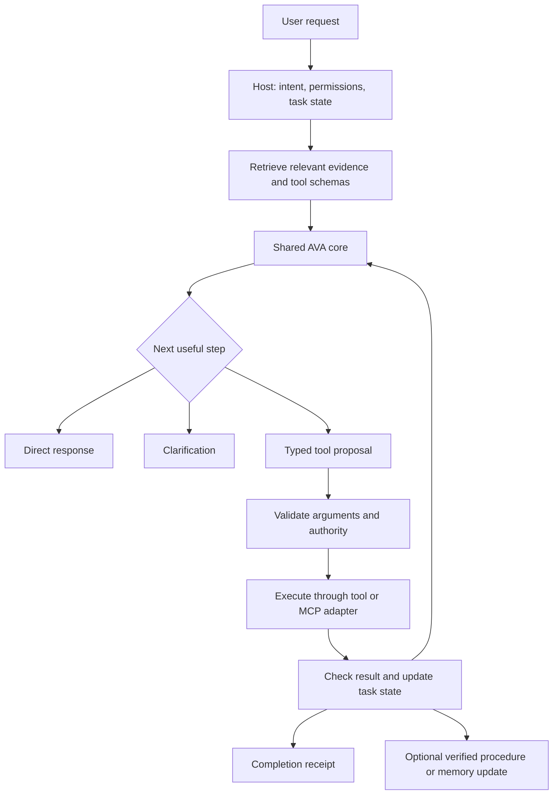

# Astra's thoughts on AVA v3

**Date:** 8 September 2026

**Purpose:** Preserve the complete recommendation from our conversation and develop it into a practical research agenda for a fast, capable, locally deployable model with at most 4 billion total parameters.

This is a strategy and research document. It does not record a new training run, a new benchmark result, or an implemented architecture. The first part preserves the earlier recommendation and its existing references. The later parts expand it without additional research or new references, as requested.

The proposed mechanisms combine established ideas with hypotheses developed for AVA. Their novelty has not been established against the literature. “Proposed” means worth testing, not proven to work or never attempted elsewhere. Numerical design examples are illustrations unless explicitly identified as previously reported results.

## Contents

1. [The complete original recommendation](#1-the-complete-original-recommendation)
2. [Define the model and product we actually want](#2-define-the-model-and-product-we-actually-want)
3. [The mathematical objective](#3-the-mathematical-objective)
4. [Parameter, memory, latency, and training arithmetic](#4-parameter-memory-latency-and-training-arithmetic)
5. [The proposed system architecture](#5-the-proposed-system-architecture)
6. [A stronger training methodology](#6-a-stronger-training-methodology)
7. [Research hypotheses for AVA](#7-research-hypotheses-for-ava)
8. [Tool calling and MCP as core capabilities](#8-tool-calling-and-mcp-as-core-capabilities)
9. [What makes it a daily driver](#9-what-makes-it-a-daily-driver)
10. [Evaluation that can support a real claim](#10-evaluation-that-can-support-a-real-claim)
11. [Experiments and decision gates](#11-experiments-and-decision-gates)
12. [Further research directions](#12-further-research-directions)
13. [A concrete task traced end to end](#13-a-concrete-task-traced-end-to-end)
14. [Recommended decisions and limits](#14-recommended-decisions-and-limits)

## 1. The complete original recommendation

**I would build AVA v3 around a strong pretrained model under 4B, then concentrate our effort on verified everyday-task training, efficient reasoning, and dependable local execution.** That gives us a credible path to outperforming much larger models on work people actually do.

The ambition should be: someone installs AVA, connects their apps, and repeatedly gets useful work finished with little supervision. General conversation, writing, explanation, and translation must remain strong enough that they keep using it between automation tasks.

I checked current primary sources through **8 September 2026**, including August releases and September research. The recommendations below are proposals; published benchmark numbers are author-reported results.

**Choose the starting model through a new comparison.** My provisional technical favorite is **LFM2.5-2.6B**, released on 4 August. Its actual parameter count is 2.69B, and its training directly targets local agent workloads. However, its model card explicitly identifies weaknesses in agentic coding and knowledge-heavy tasks. It also always reasons before answering, which creates a latency issue we would need to address. [Official model card](https://huggingface.co/LiquidAI/LFM2.5-2.6B)

I would compare these candidates:

| Candidate | Why it belongs in the comparison | Main question |
|---|---|---|
| **LFM2.5-2.6B** | Efficient hybrid architecture; recent training for tools and productivity workflows | Can we improve direct answers and broad knowledge while preserving its agent strengths? |
| **Qwen3.5-2B** | Compact multimodal foundation; useful for screenshots, documents, and general assistance | Does its broader capability compensate for weaker workflow execution? |
| **Granite 4.1-3B** | Apache-licensed general assistant with tool calling and conventional dense architecture | Does it offer a better balance of adaptability, reliability, and deployment support? |

The latter two are documented in the official [Qwen card](https://huggingface.co/Qwen/Qwen3.5-2B) and [Granite card](https://huggingface.co/ibm-granite/granite-4.1-3b).

Parameter accounting matters here. The full **Qwen3.5-4B checkpoint is approximately 4.7B**, while **Gemma 4 E2B contains 5.1B including embeddings**. Neither qualifies unchanged under a strict 4B total cap. Quantization reduces storage, not parameter count. We should also count any bundled drafter, embedding model, or vision encoder. [Qwen comparison and accounting](https://www.liquid.ai/blog/lfm2-5-2-6b), [Gemma specifications](https://ai.google.dev/gemma/docs/core/model_card_4)

There is also a distribution trade-off: Liquid's license has a commercial-use restriction tied to a **$10 million annual-revenue threshold**. If AVA must support unrestricted commercial reuse by organizations of any size, that makes the Apache-licensed candidates more attractive. [Liquid license](https://huggingface.co/LiquidAI/LFM2.5-2.6B/blob/main/LICENSE)

Your existing [August results](docs/v3/RESULTS_2026-08.md) favor Qwen over LFM on coding edits. Those results remain useful evidence, but the log explicitly says LFM's tool-use strength was unmeasured. We need an evaluation that represents this new product ambition.

**The biggest investment should be a training environment for everyday work.** I would build realistic, executable tasks involving calendars, messages, files, documents, spreadsheets, search, and reminders. Each task needs a known starting state and a way to check whether the requested outcome actually happened.

This approach has relevant evidence. Spreadsheet-RL reports a 4B-class model achieving **23.4%** on SpreadsheetBench versus **17.6%** for its Qwen3-32B baseline. That demonstrates a narrow larger-model win—and the low absolute success rate shows how far benchmark superiority can be from dependable automation. [Spreadsheet-RL, May 2026](https://arxiv.org/html/2605.22642v1)

My proposed training sequence would be:

1. **Establish a broad general-assistant baseline.** Evaluate writing, instruction following, factual calibration, reasoning, multilingual dialogue, and tools before modifying anything. Preserve a private holdout of unfamiliar workflows and connector families.
2. **Train on verified demonstrations.** Generate diverse solutions with strong teachers, execute them, and check their results. Include clarification, unavailable tools, stale information, failed calls, cancellation, and recovery. Keep general conversation and writing in the training mixture so specialization does not erase everyday usefulness.
3. **Add on-policy distillation.** Let AVA attempt tasks, then provide teacher supervision at the states AVA actually reaches. This should target its own mistakes more directly than copying only flawless teacher transcripts. Liquid's recent recipe combines domain-specialist teachers, on-policy distillation, and agentic reinforcement learning. Token-level distillation requires compatible teacher/student interfaces; arbitrary API teachers may instead provide demonstrations and feedback. [Liquid training recipe](https://www.liquid.ai/blog/lfm2-5-2-6b)
4. **Apply reinforcement learning with outcome verification.** Reward correct final documents, calendar entries, calculations, and application state. Check unintended changes as well. Use language-model judges for subjective qualities, with executable checks wherever possible. EnvFactory's work on stateful tool environments is particularly relevant to constructing this pipeline. [EnvFactory, May 2026](https://arxiv.org/html/2605.18703v1)
5. **Teach economical reasoning.** Train direct responses for easy tasks and additional reasoning for difficult ones. Reward shorter successful solutions without penalizing necessary verification. Simply suppressing reasoning tags would not establish that an always-thinking model retains its capability.

The recent **Latent On-Policy Self-Distillation** paper is worth a controlled experiment after that baseline. It reports improved tool-task performance while retaining only the student at inference. I would test it against ordinary outcome RL at equal training cost before adopting its additional machinery. [LOPD, August 2026](https://arxiv.org/html/2608.13040v1)

The durable advantage would be our collection of **realistic tasks, reliable verifiers, and useful failure data**. That can keep improving AVA as base models change.

**For architecture, I would maintain one practical development path and one focused research branch.** Start by preserving the chosen backbone's pretrained architecture and supported kernels. Architecture changes should address a measured bottleneck: context processing, memory consumption, reasoning quality, or decoding speed.

Two current directions deserve investigation:

- **Reasoning through repeated internal computation.** MELT shares its cache across reasoning loops, reducing the extra memory associated with deeper recurrence. That is relevant under a parameter cap. However, additional loops still consume compute, and the reported 1.6B adaptation required 1,040 H100 GPU-hours. Its cache remains dependent on sequence length. This is a research investment, not a cheap feature to attach. [MELT, May 2026](https://arxiv.org/html/2605.07721v1)
- **Better information flow and training efficiency.** Qwen's 26 August architecture preview introduces gated residual streams, revised sparse attention, and Muon-based optimization. These are useful experiment ideas, but its released system uses 125B main parameters plus 51B embedding parameters. Benefits at AVA's scale need independent evidence. [Qwen3.8-Flash-Next](https://github.com/QwenLM/Qwen3.8-Flash-Next)

I would treat binary and ternary weights as additional compression experiments. A September 2 study illustrates the trade-off: its particular Qwen conversion reduced aggregate accuracy from 64.5% to 54.7%. That does not invalidate low-bit training, but it reinforces the need to evaluate the actual compressed artifact. [September ternarization study](https://arxiv.org/html/2609.01962v1)

**AVA's runtime should make its limited capacity go further.** I would give it four supporting capabilities:

- **Selective retrieval:** fetch relevant personal information and tool definitions as needed.
- **Editable personal memory:** preferences, recurring routines, and task history with sources, correction, and deletion.
- **Reusable workflows:** save successful procedures with explicit inputs and checks.
- **A dependable execution host:** handle credentials, permissions, retries, cancellation, duplicate prevention, and verification outside the model.

MCP belongs in that host. The protocol received a substantial July 2026 revision, which is another reason to keep transport details out of the weights. Train AVA to understand unfamiliar tool schemas and interpret results; let maintained software handle protocol compatibility. [Current MCP release](https://blog.modelcontextprotocol.io/posts/2026-07-28/)

Consider: “Take the appointment from this email, add it to my calendar, and remind me the day before.” AVA should resolve the date and timezone, detect an existing entry, create the authorized event and reminder, then read them back to verify. If the email is ambiguous, one useful clarification should resolve it.

That entire interaction is the unit of success. Even under a simplified independence assumption, ten steps that each succeed 98% of the time produce only **81.7% end-to-end success**.

**Optimize speed around completed work.** I would begin with 4-bit and 5-bit deployment candidates, compare against a higher-precision reference, and measure cache quantization separately. Four billion parameters at four bits require **2 GB of raw weight storage**; runtime memory also includes scales, caches, buffers, and the application.

Measure:

- Time to the first useful response on short, warm requests.
- Time to verified task completion, including tool calls and retries.
- Peak memory at realistic context lengths.
- Sustained performance and battery consumption.
- Quality after quantization.

Existing runtimes already support useful techniques such as prefix reuse, constrained structured output, and speculative decoding. Their value depends on the device and workload. [llama.cpp server documentation](https://github.com/ggml-org/llama.cpp/blob/master/tools/server/README.md)

The **training hardware should be a separate decision from the user's hardware**. Larger teachers and temporary training compute can produce a compact student. I would allocate funding first to environments, verified data, and measured post-training improvements before considering pretraining from scratch.

**For adoption, make the initial experience concrete.** I would launch around three recurring needs: organizing messages and schedules; finding and transforming personal documents; and researching questions with traceable sources. Keep ordinary chat excellent throughout. Provide an easy installer, straightforward app connections, persistent scoped permissions, visible task progress, and useful completion receipts.

Evaluate both the model alone and the complete AVA application. Use version-pinned public suites such as **BFCL V4 and τ³-bench**, alongside fresh private tasks and real user pilots. Larger-model comparisons must receive equivalent tools, retrieval, and attempt budgets. [BFCL](https://gorilla.cs.berkeley.edu/leaderboard), [τ benchmark repository](https://github.com/sierra-research/tau2-bench)

My first concrete milestone would be **a controlled comparison of three eligible backbones on everyday workflows, followed by one verified-data training experiment on the winner**. That would tell us whether the biggest remaining limitation is the model, its training, or its execution software—and where an architectural invention would actually help.

The main risk is producing impressive specialized scores while losing broad usefulness or requiring too much supervision. I have not run new AVA experiments in this research pass, and training resources remain unspecified. There is credible evidence for beating larger models on selected work; universal superiority and reliable operation across everyone's devices remain ambitions to test.

## 2. Define the model and product we actually want

The proposed target is one compact, adaptable core that can understand a request, answer directly when appropriate, obtain missing information, carry out authorized work, recognize failure, and report the result accurately.

“Essential” should describe a user's experience over weeks. AVA should save more effort than it creates through supervision, correction, configuration, and waiting. A single impressive demonstration does not establish this.

The four budgets are separate:

| Budget | Proposed interpretation |
|---|---|
| Parameters | At most 4,000,000,000 unique learned scalar parameters across the model package being advertised under the cap |
| Storage and RAM | Report installed bytes and measured peak working memory, including auxiliary models and caches |
| Inference resources | Measure latency, energy, thermal behavior, and background load on specified devices |
| Development resources | Account separately for training, teacher inference, environment execution, evaluation, and engineering |

Count distinct adapter weights, embedding tables, draft models, and modality encoders. Count tied weights once when they are actually shared. Offloading parameters to system RAM or activating only a subset does not remove them from the parameter count. Multiple separately stored model variants should not be presented as one sub-4B installation without disclosing the combined package.

External documents, ordinary databases, saved procedures, and application code are not neural parameters. They still consume storage, processing time, and maintenance effort. A system augmented with these resources should be compared with larger systems given equivalent resources.

The product can start with a desktop target and expand to mobile. “Runs on an 8 GB laptop” is a measurable requirement; “runs well on every phone” is not sufficiently specified. The existing 4 GB GPU remains a useful test device, but it does not have to determine the entire training program.

Three distinctions should govern every decision:

1. **Model capability:** what the weights can do under a fixed interface.
2. **System capability:** what the model, retrieval, tools, memory, and host can accomplish together.
3. **User value:** whether that accomplishment is useful, understandable, timely, and worth repeating.

A good project can improve all three. Every published claim should identify which one was measured.

## 3. The mathematical objective

### 3.1 Optimize useful outcomes under explicit constraints

Let a task $x$ be sampled from a target distribution $\mathcal D$ of real user requests. Let $s_0$ and $s_T$ be the initial and final environment states. Define:

- $R(x,s_0,s_T)$: a bounded reward for satisfying the request, including required communication and absence of prohibited side effects.
- $T(x)$: elapsed time to the useful outcome.
- $E(x)$: energy consumed over a declared measurement boundary.
- $H(x)$: user effort, such as clarifications and corrections.
- $P$: total counted parameters.
- $M_d$: peak working memory on device $d$.

An illustrative optimization objective is:

$$
\max_{\theta,\,\mathcal H}\;
\mathbb E_{x\sim\mathcal D}
\left[
R(x,s_0,s_T)
-\lambda_T\frac{T(x)}{T_{\mathrm{ref}}}
-\lambda_E\frac{E(x)}{E_{\mathrm{ref}}}
-\lambda_H H(x)
\right]
$$

subject to:

$$
P\leq4\times10^9,\qquad
M_d\leq M_{d,\max},\qquad
B_j\geq B_{j,\min}.
$$

Here $\mathcal H$ is the host/runtime design, and $B_j$ is a retained capability such as writing quality or multilingual instruction following. Reference values normalize seconds and joules so that the coefficients have an interpretable scale.

Authorization requirements should be enforced by the host, with observed violations separately evaluated. They should not be traded away for enough positive task reward. Similarly, track useful coverage: an assistant that avoids almost every task can achieve a low error rate without helping anyone.

Keep the component metrics visible. A scalar objective is useful for optimization, but a single score can conceal an unacceptable regression.

### 3.2 Why reliability across steps dominates

For a workflow containing $n$ required successful steps, the chain rule gives:

$$
P(\text{all succeed})=
\prod_{t=1}^{n}P(S_t\mid S_1,\ldots,S_{t-1}).
$$

If each conditional probability is approximately $p$, this becomes $p^n$. At $p=0.98$ and $n=10$, it is approximately 0.8171. The homogeneous approximation is illustrative; actual failures can be correlated and recovery can change the sequence.

This motivates shorter valid workflows, stronger intermediate checks, and recovery after errors. It does not justify skipping necessary verification just to reduce the number of actions.

### 3.3 Distinguish finding a success from being dependable

For independent attempts with success probability $p$:

$$
P(\text{at least one success in }k)=1-(1-p)^k,
\qquad
P(\text{all }k\text{ succeed})=p^k.
$$

With $p=0.8$ and $k=4$, these are 99.84% and 40.96%, respectively. The first is helpful when a verifier can cheaply select a correct result. The second is closer to the expectation that the same routine should work repeatedly. Neither number can replace reporting the actual attempt budget and verifier quality.

For a serial task workload, use aggregate useful work divided by aggregate elapsed cost:

$$
\mathrm{UsefulThroughput}=
\frac{\sum_i\mathbf 1[\text{task }i\text{ successfully completed}]}
{\sum_i T_i}.
$$

Do not silently exclude failures, timeouts, or repairs from the denominator. For concurrent service, measure completed useful tasks over the actual elapsed measurement window and report concurrency and resources; summing overlapping request latencies does not measure physical service throughput.

## 4. Parameter, memory, latency, and training arithmetic

### 4.1 An illustrative parameter allocation

This is a design envelope, not a specification of an existing compatible checkpoint:

| Component | Illustrative budget |
|---|---:|
| Main language and action model | 2.80B |
| Optional vision encoder and projection | 0.40B |
| Optional draft model | 0.30B |
| Optional embedding/ranking model | 0.10B |
| Additional learned control components | 0.05B |
| Unallocated margin | 0.35B |
| **Maximum** | **4.00B** |

Optional components must earn their memory, latency, and training costs. A small classifier or deterministic rule may be sufficient instead of another neural model. A vision encoder cannot simply be attached to an arbitrary language model and expected to work without alignment training. A text-model drafter is not automatically compatible with a related vision checkpoint.

It can be better to use 2.8B well than to occupy the entire cap. Conversely, a larger core may beat several tiny helpers. Compare these allocations at the system level.

### 4.2 A concrete transformer sizing example

For a bias-free decoder with tied input/output embeddings, vocabulary size $V$, hidden width $d$, SwiGLU intermediate width $d_f$, and $L$ layers:

$$
P_{\mathrm{embed}}=Vd,
\qquad
P_{\mathrm{FFN/layer}}\approx3dd_f.
$$

With grouped-query attention, $H_q$ query heads, $H_{kv}$ key/value heads, and head width $d_h$:

$$
P_{\mathrm{attention/layer}}\approx
d(2H_qd_h+2H_{kv}d_h).
$$

The two query-width terms account for the query and output projections. Extra attention gates, biases, and other modules require additional terms.

For an illustrative dense control with:

$$
V=128000,\quad d=2560,\quad d_f=8192,\quad L=32,
\quad H_q=20,\quad H_{kv}=4,\quad d_h=128,
$$

the major matrices contain:

| Matrices | Parameters |
|---|---:|
| Tied embedding | 327,680,000 |
| FFN per layer | 62,914,560 |
| Attention per layer | 15,728,640 |
| All major matrices | 2,844,262,400 |

Two length-2560 normalization vectors per layer and one final vector add 166,400 parameters under this simplified design. This gives approximately **2.8444B**, before any other components.

This example explains the budget; it does not establish an optimal architecture. In a hybrid design, replace the attention term in the affected layers with the actual mixer parameter count. Linear-time attention does not necessarily mean fewer parameters. Feed-forward matrices may still dominate.

### 4.3 Weight storage

For groups of parameters $P_i$ stored at $b_i$ bits:

$$
M_{\mathrm{weights}}\approx
\sum_i\frac{P_i b_i}{8}+M_{\mathrm{scales}}+M_{\mathrm{metadata}}.
$$

For 3.2B weights at four bits, raw weight bits occupy 1.6 GB, using decimal GB. If every group of 64 weights carries a two-byte scale, those scales add 0.1 GB. This simplified representation totals 1.7 GB before higher-precision tensors, zero points if used, tokenizer files, and runtime workspaces.

The complete working set is closer to:

$$
M_{\mathrm{peak}}=
M_{\mathrm{weights}}+M_{\mathrm{KV}}+M_{\mathrm{recurrent}}
+M_{\mathrm{activations}}+M_{\mathrm{workspace}}+M_{\mathrm{application}}.
$$

Peak allocations need measurement. The peak may occur during loading, prompt processing, image processing, or generation rather than when the model is idle.

### 4.4 Attention cache and recurrent state

For uniform attention layers, one sequence, and equal key/value precision:

$$
M_{\mathrm{KV}}=2L_{\mathrm{att}}H_{kv}d_h n_{\mathrm{ctx}}b_{\mathrm{element}},
$$

where $b_{\mathrm{element}}$ is bytes per stored element, not bits.

An illustrative configuration with eight attention layers, four KV heads, head width 128, 8,192 tokens, and two-byte elements requires **128 MiB** of KV data. At 32 such attention layers it requires **512 MiB**. Batch size, multiple sequences, metadata, sliding windows, shared caches, and separate key/value precision modify this calculation.

Some recurrent mixers carry matrix states of a form approximately proportional to:

$$
M_{\mathrm{recurrent}}\propto
L_{\mathrm{rec}}H d_kd_v b_{\mathrm{state}}.
$$

The state can be independent of sequence length while still being substantial. A hybrid model retains the sequence-dependent cache of its full-attention layers. “Constant recurrent state” does not mean constant total model memory.

### 4.5 A useful speed bound

For batch-one decoding that streams most weight bytes each token:

$$
\mathrm{tokens/s}\lesssim
\frac{B_{\mathrm{effective}}}{M_{\mathrm{bytes\ streamed/token}}}.
$$

With an assumed effective bandwidth of 100 GB/s and 1.7 GB streamed per token, the simplified bandwidth ceiling is approximately 58.8 tokens/s. This is not a hardware prediction. Cache reuse, quantization kernels, compute, KV traffic, dispatch overhead, and memory contention change the result.

At a kernel level, a rough lower bound is:

$$
T_{\mathrm{kernel}}\gtrsim
\max\left(\frac{F}{F_{\mathrm{effective}}},
\frac{D}{B_{\mathrm{effective}}}\right),
$$

with additional launch and synchronization overhead. Smaller arithmetic alone does not guarantee a faster implementation.

User-visible time also includes prompt processing and external work:

$$
T_{\mathrm{task}}\approx
T_{\mathrm{load}}+
\frac{N_{\mathrm{uncached\ prompt}}}{r_{\mathrm{prefill}}}+
\frac{N_{\mathrm{generated}}}{r_{\mathrm{decode}}}+
T_{\mathrm{tool\ critical\ path}}+
T_{\mathrm{host}}.
$$

This is a workload approximation. If independent tools run concurrently, use their dependency graph's critical path, not the sum of all network durations. A model can decode faster while taking longer to finish because it produces more reasoning tokens or makes more calls.

Compare tokens per task and characters per second when tokenizers differ. Token/s alone is not a fair cross-tokenizer measure.

### 4.6 Training arithmetic

For dense full-model training, a common sizing approximation is:

$$
F_{\mathrm{train}}\approx6PN,
$$

where $N$ is the number of training tokens. It is a rough estimate, not a measurement for every architecture or training method.

For 3B parameters and 1B tokens, this gives $1.8\times10^{19}$ FLOPs. At a purely illustrative sustained training rate of 100 TFLOP/s, that is 180,000 seconds, or 50 hours. This excludes evaluation, teacher work, environment execution, checkpointing, failed experiments, and other overhead. It is not an estimate for the existing laptop.

LoRA reduces trainable parameters and optimizer state. It does not remove most backbone forward computation or all activation/backpropagation costs. Recurrence, long contexts, teacher logits, and RL rollouts can dominate the budget.

Keep an explicit ledger:

$$
F_{\mathrm{total}}=
F_{\mathrm{updates}}+F_{\mathrm{rollouts}}+F_{\mathrm{teachers}}+F_{\mathrm{evaluation}}.
$$

Also record GPU-hours, environment CPU-hours, wall time, and consumed energy separately. They are different quantities. A rollout-efficient method is not automatically cheaper end to end.

## 5. The proposed system architecture

### 5.1 One shared model, several available behaviors

Use one core with task-dependent behavior:

- Answer directly for conversation, explanation, and simple transformations.
- Retrieve evidence when information is missing or needs to be current.
- Produce a structured action when a tool is useful.
- Spend additional reasoning on difficult decisions.
- Clarify when essential information or authority is missing.

These behaviors need not require separate models. Initially select them through a tested prompt and host policy; introduce learned routing only if it improves the result.

The host maintains application state and exposes compact observations. The model proposes actions. The host validates and executes them, then returns evidence of what occurred.



This is a proposed architecture diagram, not a description of current AVA implementation.

### 5.2 Separate three kinds of memory

| Memory | Contents | Handling |
|---|---|---|
| Current task state | Objects, constraints, unresolved questions, planned and completed actions | Structured, versioned, recoverable |
| Personal memory | User-approved preferences and durable facts | Editable, attributable, deletable, subject to freshness checks |
| Evidence store | Source documents, tool responses, exact identifiers, receipts | Referenced through stable handles and access controls |

A compressed summary is useful for orientation. Exact dates, amounts, addresses, identifiers, permissions, and execution status should retain a path to their original evidence. Neural hidden state is an unsuitable sole ledger for those facts.

### 5.3 Prefer explicit host guarantees

The host should enforce allowed tools and scopes, validate schemas, manage credentials, track changes, and prevent accidental duplication when supported by the application. It should distinguish:

- Proposed.
- Authorized.
- Submitted.
- Confirmed by the application.
- Verified against the requested postcondition.
- Failed or still uncertain.

These states are materially different. A timeout after submission does not prove failure. The next action may be to query status rather than repeat the mutation.

Exactly-once effects cannot be guaranteed for every external API. Use idempotency keys, version checks, or duplicate detection where available; disclose uncertainty when the remote system cannot resolve it.

## 6. A stronger training methodology

### 6.1 Build a distribution of useful work

The proposed training corpus should represent what users ask, including incomplete and messy requests. A perfectly specified API exercise is only one part of daily automation.

Create task families covering:

- Conversation, explanation, writing, rewriting, and translation.
- Extracting structured information from documents and messages.
- Finding and comparing evidence across sources.
- Calendar, reminder, task, and file operations.
- Spreadsheet transformations and small data analyses.
- Tool discovery, argument construction, pagination, and resource references.
- Corrections, interruptions, changing requirements, and failed operations.
- Small scripts and code edits where they help complete ordinary work.

Include different languages, writing styles, timezones, date formats, currencies, and accessibility needs across these families. Multilingual capability is not adequately represented by translating only the final answer.

A task packet should contain a user request, initial state, available tools, permission scope, evidence, success conditions, forbidden side effects, and an evaluation procedure. Store the provenance and revision of each packet. The full packet may contain privileged information for training and grading; the model must only receive the observations it would actually have during deployment.

Generate difficulty by changing real constraints: duplicate names, unavailable dates, inconsistent records, ambiguous references, expired authorization, missing tools, and partial completion. Randomly lengthening a prompt is not a sufficient difficulty curriculum.

### 6.2 Use verified teachers without assuming they are infallible

Have teachers solve tasks in the environment. Retain correct outcomes and useful recovery trajectories. A failed attempt can supply a negative example or a repair lesson, but it must not become an unlabeled successful demonstration.

Use several teachers only when they add distinct value. Select teaching quality by the student's subsequent improvement, not solely by the teacher's benchmark rank. Teachers should produce concise task-relevant reasoning, faithful actions, and verifiable artifacts.

Where possible, create alternate correct solutions. Otherwise the learner can become dependent on a single call order or interface convention. The verifier should judge the requested state and legitimate constraints, not require exact imitation of a teacher's trace.

Public benchmark answers, hidden tests, and evaluation-specific instructions must stay out of training packets. New prompts built from the same test workflows can still leak the test distribution.

### 6.3 Train a stable supervised baseline first

An illustrative supervised objective is:

$$
\mathcal L_{\mathrm{SFT}}=
-\mathbb E_{(x,y)\sim\mathcal T}
\sum_{t\in\mathcal A}\log\pi_\theta(y_t\mid x,y_{<t}),
$$

where $\mathcal A$ selects assistant-generated tokens. Environment results should remain distinguishable from model output; training the model to impersonate successful tool responses would undermine the execution boundary.

Use a mixture of domains:

$$
\mathcal L_{\mathrm{mix}}=\sum_d w_d\mathcal L_d,
\qquad w_d\geq0,\quad\sum_d w_d=1.
$$

Choose mixture weights empirically. A long trajectory can dominate a token-weighted loss, while an example-weighted loss may overemphasize short cases. Report both tokens and episodes per domain. Preserve enough ordinary assistance to detect and prevent narrow specialization.

Begin with a modest adapter experiment if it fits the development budget. Compare fuller updates only if adaptation capacity appears to be a bottleneck. Neither low-rank training nor full fine-tuning should become an ideological requirement.

Train on sequences long enough to include a useful observation-action-result-recovery cycle. Increase context length through a measured curriculum, preserving short-request performance. Long-context capability must be trained and evaluated, not inferred from a configuration field alone.

### 6.4 Distill on the student's own states

Let $s_t$ include the current prompt, observed history, retrieved information, and valid tool definitions. Generate those states using the current student. For a compatible teacher distribution $q_d$, one illustrative forward-KL distillation loss is:

$$
\mathcal L_{\mathrm{OPD}}=
\mathbb E_{x,\,s_t\sim\pi_\theta}
\sum_t\mathrm{KL}
\left(q_d(\cdot\mid s_t)\;\|\;\pi_\theta(\cdot\mid s_t)\right).
$$

This is a proposed mathematical form, not a claim that every cited method uses this KL direction. In a practical supervised update, sampled prefixes and teacher targets can be treated as fixed for the minibatch; that update is not the full policy gradient through the state-distribution expectation. Compare alternative KL directions and training arrangements if they materially change results.

Teacher selection can depend on the domain. A specialist in calendar reasoning need not teach code editing. Full-distribution supervision generally needs aligned vocabularies and accessible logits. For incompatible teachers, use validated trajectories, corrections, or explicitly designed alignment rather than pretending token probabilities are interchangeable.

Privileged teacher context can include a verified solution or a useful skill during training. The deployed student must be evaluated without that privileged context. An improvement that disappears when the hidden answer is removed is leakage, not learning.

### 6.5 Reinforce correct effects

For a group of $G$ rollouts on the same task, a simple normalized advantage is:

$$
\widehat A_i=
\frac{R_i-\overline R}{\operatorname{std}(R_1,\ldots,R_G)+\epsilon}.
$$

A clipped policy objective can then limit the size of an update using the ratio between current and rollout-policy probabilities. In schematic form:

$$
\mathcal L_{\mathrm{policy}}=
-\mathbb E\left[
\min\left(r_i\widehat A_i,
\operatorname{clip}(r_i,1-\varepsilon,1+\varepsilon)\widehat A_i\right)
\right]
+\beta\mathcal L_{\mathrm{reference}}.
$$

The exact token normalization, reference penalty, rollout versioning, and reward allocation must be specified by an implementation. This equation is a design outline, not a complete RL algorithm.

The reward should distinguish:

| Component | What it asks |
|---|---|
| Outcome | Did the requested state or artifact result? |
| Constraints | Were dates, recipients, amounts, scope, and other requirements respected? |
| Side effects | Were unrelated resources left intact? |
| Communication | Did AVA accurately explain completion, failure, or uncertainty? |
| Efficiency | Were unnecessary tokens, calls, and retries avoided? |

Efficiency penalties should be subordinate to success and required checks. Refusing everything, skipping verification, or making an unconfirmed completion claim must not become a cheap way to maximize reward.

Executable verification is powerful but imperfect. A test can omit a requirement; a generated test suite can agree with a generated wrong answer. Use independently authored invariants, held-out checks, and adversarial cases to evaluate verifier quality.

### 6.6 Preserve the general assistant

Use replay from broad assistance tasks and a reference model where useful. A proposed retention term is:

$$
\mathcal L_{\mathrm{retain}}=
\mathbb E_{x\sim\mathcal D_{\mathrm{general}}}
\mathrm{KL}(\pi_{\mathrm{reference}}\;\|\;\pi_\theta).
$$

Evaluate the actual behavior rather than assuming the regularizer guarantees retention. Too much reference pressure can also prevent improvement. Check writing, factual uncertainty, refusal appropriateness, multilingual tasks, and conversation after every substantial specialist update.

### 6.7 Consolidate carefully

Personal preferences and task history should initially update external memory and verified procedures. Central model updates can later learn from consented, sanitized, execution-checked examples.

Do not assume that an unattended overnight self-training loop will improve general intelligence. A model can repeatedly reinforce its own mistakes or learn to exploit its verifier. Any self-generated training cycle needs an independently maintained evaluation set, rollback, and evidence of net improvement.

## 7. Research hypotheses for AVA

The following are proposed experiments. Several ingredients are established techniques; their particular combinations, priorities, and evaluation conditions are suggestions for AVA. None is presented as a proven new invention. Start with the host/interface experiments before changing the backbone.

### 7.1 Learn from execution receipts

**Hypothesis:** A small model may complete workflows more reliably when its task state is updated from explicit application receipts and checked postconditions, rather than inferred from a long conversation.

**Mechanism:** Each completed operation produces a compact record containing the action, affected object, application response, state version when available, and verification status. The model learns to distinguish “requested,” “submitted,” and “confirmed.” Completed records stay linked to original evidence.

An illustrative state transition is:

$$
z_{t+1}=f_\theta(z_t,o_{t+1},r_{t+1}),
$$

where $r_{t+1}$ is a host-produced receipt. The host remains authoritative about what was actually executed. The model's summary of a receipt is not an execution certificate.

**Smallest test:** Use identical tasks and tools with raw transcripts versus transcripts plus structured receipts. Inject delayed responses and ambiguous timeouts. Measure duplicate writes, false completion statements, and final-state success.

**Failure mode:** A receipt proves that a service returned something, not that every semantic requirement was satisfied. A malicious or faulty service can supply false data. Retain an explicit distinction between service acknowledgment and independent verification.

**Keep it if:** It improves task success or reduces false completion at an acceptable token and latency cost, including on unfamiliar connectors.

### 7.2 Learn when additional thinking is worthwhile

**Hypothesis:** AVA can save substantial time by learning when to answer, retrieve, verify, reason further, or clarify.

Given current information $b$ and a possible computation or observation $u$, define a conceptual value of information:

$$
\operatorname{VOI}(u\mid b)=
\mathbb E[V(b')\mid b,u]-V(b)-\lambda C(u).
$$

Here $V$ estimates useful achievable task value, and $C$ is normalized cost. This is a decision principle, not an oracle available at inference.

**Mechanism:** Run cheap and expensive modes from matched starting states during training. Record where extra computation changes the verified outcome. Train a controller on those differences and calibrate it on held-out task families. Permit a necessary clarification even when it increases interaction count.

**Smallest test:** Compare always-short, always-extended, simple-rule routing, and learned routing. Use the same overall task-time limits.

**Failure mode:** Token entropy is not a calibrated probability of being wrong. A confidently wrong model can halt too early; an overcautious controller can think forever. Both errors must be measured.

**Keep it if:** The controller improves the success-versus-latency curve and retains hard-task coverage. A faster average caused by abandoning difficult work does not qualify.

### 7.3 Keep exact facts outside compressed state

**Hypothesis:** Compact semantic state plus references to exact evidence may preserve more task-relevant information than a prose summary of equal prompt length.

**Mechanism:** Compress narrative context into a short task summary while preserving exact identifiers, dates, quantities, constraints, and source handles in structured records. Retrieve the relevant records for the next action. Train the model to cite or copy a supplied value instead of reconstructing it from memory.

A useful conceptual objective resembles rate-distortion optimization:

$$
\min_c\;\operatorname{Size}(c)
+\lambda\operatorname{TaskError}(c),
$$

with hard preservation requirements for selected fields. The size/error trade-off is task-dependent; preserving a critical account identifier can matter more than preserving an entire paragraph.

**Smallest test:** Compare full transcripts, free-form summaries, and structured summaries with evidence handles at equal context budgets. Include distant references and mid-task corrections.

**Failure mode:** The summarizer can omit an important constraint or preserve an outdated fact. Version records and support correction. Test the ability to reopen evidence when a compact summary is insufficient.

**Keep it if:** It lowers context and prefill costs while retaining exact-argument accuracy and long-task success.

### 7.4 Train tool understanding independently of tool names

**Hypothesis:** Training against changing tool names, parameter order, and surface formats can reduce brittle memorization and improve use of unfamiliar MCP servers.

**Mechanism:** Generate equivalent tool interfaces with different names and schema arrangements while preserving documented semantics. Change some semantics deliberately in other tasks so the model must read descriptions. Include irrelevant tools, similarly named tools, missing capabilities, and required discovery steps.

For diagnostics, let $D$ mean the necessary tool is available after discovery, $S$ mean the correct tool is selected, and $A$ mean its arguments are semantically correct. The chain rule gives:

$$
P(D\cap S\cap A\mid x)=
P(D\mid x)
P(S\mid D,x)
P(A\mid D,S,x).
$$

This does not assume independence. Authorization, execution, and final-state verification are additional stages with their own conditional failure rates.

**Smallest test:** Hold out entire connector families and operation patterns. Name randomization within a familiar family is a weaker test and should be reported separately.

**Failure mode:** Tool descriptions may be incomplete or deceptive. Reading a description is not authorization. A retrieval system can also exclude the correct tool before the model gets a chance to choose it.

**Keep it if:** Unseen-tool success improves with no material loss on familiar tools. Measure retrieval recall, selection accuracy, and argument correctness separately.

### 7.5 Compile reliable routines into explicit procedures

**Hypothesis:** Frequently repeated workflows can become faster and more dependable when AVA fills the parameters of a checked procedure instead of replanning every step.

**Mechanism:** After successful demonstrations, propose a procedure with inputs, preconditions, tool requirements, postconditions, and a fallback. Validate it on changed dates, renamed objects, missing resources, and interrupted runs before reuse. Store it as ordinary user-visible procedure data.

If compilation costs $C_{\mathrm{compile}}$ seconds and saves $\Delta T$ seconds per valid reuse, time breaks even after:

$$
n>\frac{C_{\mathrm{compile}}}{\Delta T}.
$$

For example, 30 seconds of validation and compilation with five seconds saved per reuse breaks even after more than six reuses. Reliability and maintenance can matter more than this simple time calculation.

**Smallest test:** Repeated invoice organization, meeting preparation, or document filing with varied inputs. Compare fresh planning against procedure execution plus validation.

**Failure mode:** A cached procedure can silently stop matching the user's intent or a changed API. Check preconditions and tool versions; fall back to planning when they fail.

**Keep it if:** Repeated tasks become faster without increasing wrong-object operations or suppressing legitimate changes in user intent.

### 7.6 Use a small typed representation for plans

**Hypothesis:** A small model may handle some automation tasks better by producing a typed plan that deterministic software can check and execute.

**Mechanism:** Represent operations with explicit resource references, constraints, and dependencies. Use parsers and deterministic libraries for exact calculations, date conversions, and schema validation. Let the model resolve language ambiguity and select the operation.

An illustrative plan node is:

```json
{
  "operation": "create_calendar_event",
  "source_ref": "mail:appointment-17",
  "calendar_ref": "calendar:personal",
  "start": "2026-09-11T15:00:00+04:00",
  "duration_minutes": 30,
  "reminder_minutes_before": 1440,
  "preconditions": ["source_fields_confirmed", "no_matching_event"],
  "postconditions": ["event_fields_match_source", "reminder_present"]
}
```

This JSON is an illustrative intermediate representation, not an existing AVA API or a permission grant. The host must bind references, validate actual authority, and evaluate the stated conditions.

**Smallest test:** Calendar and spreadsheet tasks with exact constraints. Compare direct tool calls with a typed plan under the same permitted tool set.

**Failure mode:** An overly rigid representation can exclude legitimate workflows. A syntactically valid plan can still express the wrong intent. Keep an escape path to clarification or ordinary tool use.

**Keep it if:** It improves exactness and reduces model tokens while preserving supported-task coverage. Give larger-model baselines the same compiler when making system comparisons.

### 7.7 Allocate internal computation around decisions

**Hypothesis:** Additional internal computation may be most useful before consequential decisions and after surprising observations, rather than uniformly on every token.

**Mechanism:** In a dedicated architecture branch, allow a shared refinement block to run a bounded number of times over task representations. An illustrative recurrence is:

$$
h^{(k+1)}=h^{(k)}+g_k\odot F_\theta(h^{(k)},c),
\qquad 0\leq g_k\leq1.
$$

Here $c$ represents available context. This schematic does not specify attention-cache semantics or prove a useful halting policy. Both are necessary for a real implementation.

Compare refinement on action-boundary representations with refinement on every generated token. Train explicit halting behavior under matched latency budgets. Reusing weights saves parameter count but adds operations.

**Smallest test:** Start from an existing compatible recurrent model or a small research control. Measure difficult tool decisions, exact copying, long-context retrieval, and actual batch-one runtime.

**Failure mode:** Repeated computation can amplify an error, harm cache consistency, or cost more than generating a short explicit check. Architectural surgery may damage pretrained behavior and require substantial recovery training.

**Keep it if:** It beats ordinary adaptive text reasoning at equal total parameters and elapsed time. A gain only at much greater compute is a different trade-off and must be reported as such.

### 7.8 Allocate precision according to task sensitivity

**Hypothesis:** A measured mixture of precisions can preserve tool-call and reasoning accuracy better than uniformly reducing every eligible tensor to the same bit width.

**Mechanism:** Quantize groups of layers or tensors independently and measure the downstream effect. Use representative calibration data containing exact names, unusual identifiers, multilingual text, long prompts, and realistic tool schemas.

An illustrative allocation problem is:

$$
\min_{b_1,\ldots,b_L}\sum_\ell s_\ell(b_\ell)
\quad\text{subject to}\quad
\sum_\ell\frac{P_\ell b_\ell}{8}+M_{\mathrm{overhead}}\leq M_{\max},
$$

where $s_\ell$ estimates task loss at a supported precision. Layer interactions mean the additive estimate must be checked on the final combined model.

**Smallest test:** Compare Q8, Q5, Q4, and a supported mixed allocation. Change weight precision and KV precision in separate experiments before combining them.

**Failure mode:** The most sensitive tensors on a small calibration set may not be the most sensitive in production. Mixed precision can also cause kernel fallbacks and reduce speed.

**Keep it if:** The deployed artifact improves the quality-memory-latency trade-off. Perplexity alone is insufficient.

### 7.9 Predict likely continuations without prematurely executing them

**Hypothesis:** AVA may reduce latency by preparing likely next steps while preserving the requirement that real effects follow confirmed state.

**Mechanism:** Begin with speculative decoding. A drafter proposes tokens; the target validates them using the appropriate acceptance procedure. Separately, the host can prepare schemas or local plan branches for likely outcomes. Speculative planning must not send messages, submit purchases, or mutate external state before those actions are actually authorized and chosen.

For $k$ draft tokens with an illustrative independent acceptance probability $a$, the expected emitted tokens in a standard draft/verify cycle with a correction or bonus token are:

$$
\mathbb E[N_{\mathrm{cycle}}]=\sum_{j=0}^{k}a^j.
$$

For $k=4$ and $a=0.8$, this is 3.3616 tokens. A simplified speedup estimate is:

$$
\operatorname{Speedup}\approx
\frac{\mathbb E[N_{\mathrm{cycle}}]c_{\mathrm{target/token}}}
{kc_{\mathrm{draft/token}}+c_{\mathrm{verify}}(k)}.
$$

Actual acceptance rates are not independent or constant, and verification has cache and scheduling costs. The drafter also consumes memory and parameters.

**Smallest test:** Short answers, long writing, and multi-turn tool calls on the target hardware. Include the prompt-processing cost and sustained thermal behavior.

**Failure mode:** A drafter can accelerate long completions while slowing short requests through added memory pressure. A changed student may need its drafter retrained or recalibrated.

**Keep it if:** Time to useful completion improves across the chosen workload mixture. Disable it on workloads where it loses.

### 7.10 Generate training tasks around productive failures

**Hypothesis:** The best next training example is often a common, consequential failure that the student can plausibly learn to solve.

**Mechanism:** Cluster failures by cause: missing evidence, wrong tool, wrong argument, misunderstood intent, unsuccessful recovery, or overly verbose reasoning. Generate variations that isolate the failure while retaining independent verification.

One proposed priority score is:

$$
q(x)\propto
\frac{f(x)v(x)[1-p_{\mathrm{success}}(x)]p_{\mathrm{learnable}}(x)}
{c(x)+\epsilon},
$$

where frequency $f$, value $v$, success probability, learnability, and cost are estimated. This is a heuristic, not a proven optimal curriculum. Preserve a minimum allocation to rare important tasks and broad capabilities.

**Smallest test:** Compare random additional data with failure-targeted data at equal training and generation budgets.

**Failure mode:** The estimates may overfit the current evaluation set or repeatedly select tasks the verifier finds easy rather than tasks users value. A self-generated curriculum can become narrower every cycle.

**Keep it if:** Improvement transfers to a separately maintained holdout and broad capability remains stable.

### 7.11 Learn to predict useful postconditions

**Hypothesis:** A lightweight auxiliary objective that predicts relevant consequences of a proposed action may improve planning and error detection.

**Mechanism:** Given current observations and a proposed action, predict a compact set of expected state changes and possible failure conditions. Train against observed outcomes from sandbox execution. Use predictions to choose checks and identify uncertainty.

An illustrative auxiliary loss is:

$$
\mathcal L_{\mathrm{transition}}=
-\log p_\theta(\Delta s_{\mathrm{observable}}\mid o_t,a_t).
$$

Only observed, relevant changes belong in the target; the model should not infer hidden application state as ground truth. This learned predictor can advise the host but cannot certify a real operation.

**Smallest test:** Compare a model trained with and without this auxiliary target on tasks involving dependencies and failure recovery.

**Failure mode:** The predictor can hallucinate success and make the policy more confident in a bad plan. If it merely repeats the expected API documentation, it may add no useful capability.

**Keep it if:** It improves independently verified outcomes and uncertainty calibration, not just prediction accuracy on familiar simulated transitions.

### 7.12 Train consistency across equivalent task representations

**Hypothesis:** Small models may become more reliable by learning that semantically equivalent requests and tool results should preserve the same essential decisions.

**Mechanism:** Create paired tasks that differ in language, formatting, field order, or irrelevant narrative. Keep the intended state change equivalent. Train or score consistency of resource selection, constraints, and resulting state, while permitting different valid wording and action sequences.

A proposed regularizer is:

$$
\mathcal L_{\mathrm{equiv}}=
d\big(\Phi(\pi_\theta(x)),\Phi(\pi_\theta(T(x)))\big),
$$

where $T$ is a verified meaning-preserving transformation and $\Phi$ extracts task-relevant decisions. In practice, use supervised targets or an explicitly chosen estimator; discrete executed trajectories are not automatically differentiable.

**Smallest test:** Equivalent multilingual calendar tasks, reordered JSON tool results, and documents with irrelevant inserted paragraphs.

**Failure mode:** A supposed paraphrase can change a date, negation, authority, or scope. Incorrect equivalence labels would train the model to ignore meaningful differences.

**Keep it if:** It reduces inconsistency on independently checked transformations while retaining sensitivity to genuinely changed requirements.

## 8. Tool calling and MCP as core capabilities

### 8.1 A tool call is a sequence of distinct abilities

Evaluate whether AVA can recognize that a tool is needed, discover it, select it, form correct arguments, respect authorization, interpret the result, and decide whether the task is complete. Valid JSON measures only one boundary in this sequence.

For a task that requires a unique tool, and a retrieval design without a fallback, total success cannot exceed the probability that the necessary tool is retrieved. This makes tool discovery a first-class evaluation target.

The model should have a small stable set of discovery and data-access operations, with detailed schemas loaded as needed. Cache catalogs when appropriate, but invalidate caches when tools, permissions, or accounts change.

### 8.2 Model responsibilities versus host responsibilities

| Model learns | Host implements |
|---|---|
| Interpret the request and its constraints | Protocol and transport compatibility |
| Understand available tool descriptions | Authentication and credential storage |
| Choose useful next actions | Authorization checks and scope enforcement |
| Construct semantically appropriate arguments | Schema parsing and type validation |
| Interpret errors and partial results | Retry mechanics, status queries, and cancellation |
| Ask useful clarifications | State versions, transaction records, and receipts |
| Report outcomes accurately | Sandboxing and application-specific checks |

Train the model on the exact observation and tool-result conventions used by the host. A training/deployment mismatch in role labels, tool names, or error structures can erase otherwise useful learning.

### 8.3 Test unfamiliar and adversarial conditions

The research suite should include missing tools, renamed operations, changed schemas, pagination, large results, expired credentials, denied permissions, unavailable services, and timeouts after partial success.

Treat retrieved emails, documents, web pages, and tool responses as evidence, not automatic authority to change goals or permissions. Include examples where external content requests unrelated actions. The host's control boundary should remain effective even when the model proposes the wrong action.

### 8.4 Keep intermediate data compact

Return bounded excerpts, typed summaries, and handles for large results. Permit follow-up access to the original data. Preserve exact rows or fields needed for an operation.

A compact representation should identify truncation and omitted fields. Silent truncation can cause confident mistakes. Train AVA to fetch additional evidence when a result is incomplete.

### 8.5 Support durable, scoped automation

Users should be able to grant a stable scope for routines they trust. AVA should honor that scope across sessions and recognize when a request falls outside it. Useful controls include pause, cancel, review recent actions, revoke a connection, and undo where the application supports it.

The target behavior is appropriate independence. Excessive clarification and premature action are both failures of understanding.

## 9. What makes it a daily driver

### 9.1 Preserve the ordinary experience

AVA should be pleasant to use for requests that require no automation: explain a concept, rewrite a message, summarize a document, translate a passage, suggest alternatives, or reason through a decision. Evaluate tone, precision, completeness, and whether the response respects the user's requested length.

The model should adapt verbosity to the task. A quick answer should be quick. A difficult explanation should be allowed enough space. Optimizing only token count would produce an assistant that is terse but unhelpful.

Factual knowledge and retrieval have complementary roles. AVA needs a useful internal foundation for understanding and conversation, plus retrieval for personal and changing information. Teach it to distinguish what it knows, what it has just checked, and what remains uncertain.

### 9.2 Make personalization inspectable

Personalization should reduce repeated explanation. Save durable preferences with explicit scope: preferred writing style, work hours, frequently used folders, or how to prepare a recurring report.

Separate explicit preferences from tentative inferences. A user choosing an unusual meeting time once should not silently reset their normal schedule. Record where a preference came from, when it was last confirmed, and whether it applies to the current task.

Memory deletion must propagate through retrieval indexes, cached summaries, and saved procedures where relevant. Personal information copied into model weights is much harder to remove reliably, which is another reason to start with external memory.

### 9.3 Support multilingual work across the whole workflow

Test requests in one language that refer to documents or applications in another. Preserve names, addresses, exact quotations, date conventions, and numeric formatting. Do not assume that good English tool calling transfers unchanged to Arabic, Hindi, or other scripts.

A smaller vocabulary may reduce parameters and output-head cost while increasing tokens per sentence. Evaluate the combined effects on latency, context capacity, and language coverage. Tokenizer changes also require adaptation and can disturb a pretrained model.

### 9.4 Treat voice and vision as measured extensions

Voice input, read-aloud output, screenshots, scanned documents, and camera input can make AVA much easier to use. They also add parameters, buffers, inference time, and interface complexity.

An initial text-first core can use operating-system accessibility interfaces or structured document extraction when available. A multimodal edition should report its own complete parameter and memory budget. External speech services or OS models should be disclosed as dependencies, not silently counted as capabilities of the core weights.

Select modalities based on actual frequent tasks. Reading a receipt accurately may matter more to daily usefulness than broad image generation. Evaluate whether the vision path preserves the language model's tool and reasoning skills.

### 9.5 Give people an understandable installation

The intended experience should include:

- A normal installer and automatic selection of a tested runtime configuration.
- Clear descriptions of what a connected app permits AVA to do.
- Local tasks that remain useful without a cloud model account.
- Visible progress for longer jobs, including cancellation and resumption.
- Completion messages that link to the created artifact or changed resource.
- A straightforward way to inspect memory, disconnect apps, and remove the installation.

These are proposed product requirements, not current AVA capabilities.

### 9.6 Learn from use without making surveillance a requirement

Measure voluntary user satisfaction, corrections, time saved, and repeat use. Provide a useful local experience even when users decline to share interaction data.

For research contributions, distinguish aggregate performance counters from actual task content. Any shared examples need consent, sanitization, and an appropriate handling process. A private assistant should not require exporting personal documents to improve the central model.

Optional cloud assistance can be a separate product choice. If offered, clearly distinguish cloud-assisted results from local-only results. The local capability claim should stand on its own measurements.

## 10. Evaluation that can support a real claim

### 10.1 Build an evaluation matrix

| Dimension | Representative evidence |
|---|---|
| General assistance | Writing, explanation, summarization, translation, instruction following |
| Reasoning | Numerical, logical, scientific, and practical constrained decisions |
| Grounding | Correct use of documents, provenance, factual uncertainty, refusal to invent missing evidence |
| Tool use | Discovery, selection, exact arguments, result interpretation, completion |
| Workflow reliability | Final state, unintended side effects, recovery, interruptions, repeated success |
| Personal memory | Recall, correction, deletion, freshness, cross-session consistency |
| Multilingual use | Instructions, evidence, tools, and output across supported language combinations |
| Efficiency | Cold and warm latency, task time, energy, peak RAM, thermal stability |
| Product value | User correction burden, satisfaction, useful repeat use, setup friction |

Keep the previously identified public benchmarks as controls, but do not let them define the whole product. A model can improve on a public tool benchmark while becoming worse at ordinary user requests.

### 10.2 Split at the level where generalization matters

Use held-out task families, source documents, connector families, organizations, and time periods where feasible. Keep all near-duplicates and variants of a seed task in the same split.

Distinguish these tests:

1. Familiar tool, new arguments.
2. Familiar semantics, renamed or reformatted tool.
3. New tool within a familiar application family.
4. Entirely unfamiliar connector family.
5. New combinations of familiar operations.
6. Changed requirements during an unfinished workflow.

Success on the first two does not establish success on the others.

Training, development, and final reporting sets should serve different purposes. Frequent manual inspection of the final test set turns it into development data. Maintain fresh prospective evaluations for major release claims.

### 10.3 Compare both models and complete systems

Run two comparison tracks:

| Track | Fixed conditions | What a win supports |
|---|---|---|
| Model comparison | Equivalent prompts, tools, evidence, decoding budgets, and scoring | Better model behavior under the specified conditions |
| Complete-system comparison | Equivalent permissions, information access, task budget, and outcome requirements | Better AVA system performance for those tasks |

Report the backbone revision, adapters, quantization, context cap, reasoning budget, runtime revision, hardware, tool versions, and attempt count. A new runtime or a different prompt can change a result without any change to the model's weights.

When comparing different tokenizers, include time budgets and information access rather than relying only on equal token counts. When comparing different hardware, disclose the device and resource differences.

### 10.4 Use paired comparisons and inspect real failures

Evaluate competing configurations on the same tasks and starting states. Interleave performance measurements to reduce warm-up and thermal confounding. Record both cold and warm behavior.

Report uncertainty, not only point estimates. For tasks derived from shared templates or environments, resample or cluster at that family level when estimating confidence intervals. Treating every paraphrase as independent exaggerates the evidence.

Inspect a concrete successful and failed trajectory before trusting a new evaluation path. Confirm that the grader executed the right artifact, read the right output, and counted truncation, crashes, and timeouts consistently.

Measure where the failure happened. Useful categories include missing evidence, misunderstood intent, unavailable capability, retrieval failure, invalid arguments, execution failure, incorrect recovery, bad verification, and false completion.

### 10.5 Evaluate the verifier itself

Use intentionally wrong outputs, partially correct outputs, alternate valid workflows, and adversarial examples to estimate false acceptance and false rejection. Test the verifier on actions that achieve the requested visible result while modifying unrelated resources.

A verifier that shares the same blind spots as the generator can produce convincing but incorrect progress. At least part of the evaluation should come from independent human-authored constraints or application state checks.

Zero observed failures is not proof of zero risk. Under an idealized independent Bernoulli model, observing zero failures in $n$ trials gives a one-sided 95% upper bound:

$$
p_{\mathrm{failure,upper}}=1-0.05^{1/n}\approx\frac{3}{n}.
$$

At 1,000 trials that is approximately 0.30%. Heterogeneous tasks, correlated failures, and adversarial inputs can make this simple model inappropriate. The calculation illustrates why a zero in a small report should not be presented as a guarantee.

### 10.6 Proposed release criteria

Set numerical thresholds after the baseline, using the actual supported workflows and hardware. The criteria should require:

- A repeatable improvement over the selected unmodified backbone.
- Competitive results against stronger models on clearly named daily-work distributions.
- Preserved general-assistant capability within predefined tolerance.
- High repeat reliability on the routines promoted as dependable.
- Acceptable latency and peak memory on every advertised device profile.
- Accurate reporting of completion and failure.
- Successful handling of interruption, permission changes, and partial execution.

For an initial engineering target, a short warm request should ideally produce useful output in around one second, and basic text generation should feel comfortable at roughly 20–30 tokens/s on the chosen baseline device. These are proposed experience targets, not measured AVA results or promises across all devices. A task with external dependencies needs its own completion-time target.

## 11. Experiments and decision gates

### 11.1 Order the work by what it can resolve

Each experiment should answer one important question and produce a reproducible comparison. The following ordering is a proposal, not a calendar commitment.

| ID | Experiment | Main variable | Decision it resolves |
|---|---|---|---|
| E01 | Baseline eligible backbones | Core model | Which model is the best starting point for this task distribution? |
| E02 | Validate environment and grader | Known correct, wrong, and alternate outcomes | Can we trust the measurement? |
| E03 | Structured state and receipts | Observation format | Can the host improve reliability before training? |
| E04 | Verified workflow SFT | Targeted data | Can a modest update improve useful work without broad regression? |
| E05 | Direct versus extended responses | Reasoning policy | Where does more thinking help enough to justify latency? |
| E06 | Outcome RL versus OPD | Training signal | Which signal produces more improvement per complete development budget? |
| E07 | Unfamiliar tool curriculum | Tool/schema variation | Does learning transfer beyond memorized interfaces? |
| E08 | Precision comparison | Weight precision | Which artifact offers the best quality-memory trade-off? |
| E09 | Cache and speculation comparison | Runtime optimization | Which changes shorten actual task time? |
| E10 | Verified reusable procedures | Procedure reuse | Can repeated daily work become cheaper and more dependable? |
| E11 | Focused architecture branch | One structural change | Does a new architecture outperform the practical baseline at matched resources? |
| E12 | User pilot and prospective holdout | Real task distribution | Does measured capability translate into repeated user value? |

Validate the scoring path before drawing a backbone conclusion; E01 can collect outputs while E02 determines whether their scores are trustworthy. Optimization results are meaningful only after the initial comparison is sound.

### 11.2 A practical staged program

**Stage A: define and measure.** Create a small smoke collection of realistic workflows, validate the state checks, and collect baseline outputs from the eligible models. Expand the holdout before making a ranking claim. Identify the dominant failures and device bottlenecks.

**Stage B: improve interfaces and data.** Test structured observations, clearer error returns, bounded tool discovery, and verified SFT. These experiments can reveal whether a problem attributed to model size is actually an interface or data problem.

**Stage C: improve the learning signal.** Compare outcome RL, on-policy distillation, and their justified combinations from the same starting checkpoint. Count teacher computation and environment execution. Introduce adaptive reasoning only with checks that difficult tasks remain supported.

**Stage D: optimize the deployable artifact.** Evaluate weight precision, cache precision, context profiles, prefix reuse, and speculative decoding. Repeat the meaningful task checks after the final combination, because individually beneficial changes can interact badly.

**Stage E: run an architectural experiment.** Choose the highest remaining bottleneck and change one mechanism. Keep a strong existing baseline available. Require recovery of broad capability before treating a new structure as progress.

**Stage F: test whether people keep using it.** Run a voluntary pilot on representative devices and tasks. Incorporate common failures into new training data while protecting a fresh evaluation stream. Ship a model card and system report that distinguish observed capabilities from ambitions.

### 11.3 What every experiment records

Record the hypothesis, starting checkpoint, data and split identifiers, precision, seeds, tool/runtime revisions, commands used by the actual implementation, device, resource use, generated outputs, scoring results, and decision.

Record reasons to reject the hypothesis. A failed experiment that rules out an expensive direction is useful. A report that converts every result into a success leaves the project unable to choose.

The decision should be one of: supported under the tested conditions, rejected under those conditions, or inconclusive. Inconclusive results need a specific reason, such as insufficient sample size or unstable measurement.

### 11.4 Conditions for stopping a branch

Pause or reject a direction when it repeatedly loses to a simpler control, cannot preserve broad capability, requires unsupported kernels on target devices, exceeds the parameter or memory envelope, or gains only through a changed evaluation budget.

Do not continue a branch solely because it is unusual or has already consumed time. Equally, do not reject a valid result because it came from an ordinary technique.

## 12. Further research directions

These are additional areas to investigate later. The expected benefits are hypotheses. They require new research or experiments before implementation; no additional literature verification was performed for this expansion.

| Direction | Potential value for AVA | Critical question or counterexample |
|---|---|---|
| Grow a strong smaller student within the cap | Add capacity where the existing model is weakest | Does the new capacity learn useful behavior faster than selecting a stronger existing backbone? |
| Prune a stronger donor and recover with distillation | Inherit capability from a model initially above the cap | Can the final unique-parameter count genuinely fall below 4B without losing the desired skills? |
| Search the balance of full attention and recurrent mixers | Reduce long-context costs while preserving exact retrieval | Do copied identifiers, distant constraints, and multi-hop reasoning survive? |
| Learn bounded depth or early exits | Spend less compute on easy tokens or tasks | Are confident mistakes disproportionately assigned too little computation? |
| Gated residual and optimizer experiments | Improve information flow or training efficiency | Does the improvement persist at this scale and at equal training cost? |
| Small conditional adapters inside one core | Specialize behavior with modest added parameters | Does routing complexity outweigh the gain, and are all stored adapters counted? |
| Quantization-aware recovery after task training | Improve low-bit retention on the actual workload | Is the gain larger than simply choosing Q5 or allocating more precision to sensitive tensors? |
| Native binary or ternary training branch | Reduce memory traffic with suitable kernels | Can it match a good conventional quantized model under the same total training and deployment budget? |
| Task-conditioned retrieval depth | Retrieve more only when evidence is insufficient | Can the controller recognize that an omitted fact matters? |
| Event-based task summaries | Avoid repeatedly processing unchanged state | Can corrections and stale observations be handled without invalid cache reuse? |
| Object-centric memory | Track the same person, file, event, or project across tasks | Can it disambiguate similar objects and prevent cross-account mixing? |
| Contrastive training on evidence selection | Improve grounding with distractors | Does it help with genuinely new documents, not just familiar lexical patterns? |
| Causal task variations | Teach sensitivity to changed constraints and invariance to irrelevant changes | Are the transformations truly semantics-preserving or intentionally semantics-changing as labeled? |
| Distill multiple specialist policies into one student | Combine distinct strengths without serving all teachers | Can the generalist retain the specialists' gains without destructive interference? |
| Offline preference learning from corrected workflows | Learn what users actually wanted after a correction | Can the labels separate style preferences from objective execution errors? |
| Compact action-block generation | Produce a short structured plan with fewer serial generation steps | Does reduced sequential reasoning harm dependencies and argument correctness? |
| Non-autoregressive generation for narrow structured outputs | Potentially accelerate fixed-format action proposals | Do iterative refinement and validation costs erase the speed advantage? |
| Adaptive verification | Apply expensive checks where they most reduce expected error | Does a low-cost confidence estimate miss rare costly mistakes? |
| Efficient voice and document perception | Make the model accessible and useful beyond typed chat | Can the full installation remain within its parameter, memory, and energy budget? |
| Background learning of procedures | Improve repeated tasks without changing weights | Can every procedure be invalidated when its assumptions or permissions change? |
| Retrieval that uses both lexical and semantic matching | Preserve exact-name lookup while finding paraphrases | Does the combined retrieval actually improve downstream success at its extra cost? |
| Shared or compressed KV representations | Reduce long-context memory pressure | Are cache semantics and exact retrieval preserved after compression? |
| Lightweight prediction of action consequences | Improve planning and targeted verification | Does the predictor add information rather than repeat the policy's own mistaken belief? |

### 12.1 An especially promising combination to test

The most distinctive practical combination proposed here is:

1. A compact shared model that interprets requests and chooses actions.
2. Structured task state with exact evidence references.
3. Receipts and postconditions that distinguish attempted actions from completed effects.
4. Training on failures caused by ambiguity, interruptions, and incomplete observations.
5. A learned choice between direct response, retrieval, additional reasoning, and clarification.
6. Verified procedures that make repeated tasks progressively cheaper.

The hypothesis is that these components can convert limited model capacity into more reliable completed work. Their value would come from their interaction, but each must first earn its place through an isolated comparison. A final combined experiment must then check that the gains survive together.

### 12.2 A more ambitious model architecture proposal

If the practical system identifies a persistent reasoning bottleneck, a research student could combine an efficient language backbone with a small set of task-state representations and a shared refinement block applied near decisions.

The task-state representations would encode the current goal, unresolved constraints, relevant objects, and expected postconditions. Exact evidence remains outside these vectors. The refinement block would update the representations for a bounded number of steps, and the language/action decoder would condition on the result.

Train three coupled capabilities: answer or act correctly, recover relevant constraints from task representations, and stop refining when extra computation is not useful. Compare this against putting the same structured information in ordinary prompt tokens. If prompt tokens work as well, the architectural complexity is unnecessary.

Possible auxiliary objectives include constraint reconstruction, evidence-reference selection, and observed postcondition prediction. Avoid using an auxiliary metric as the final success criterion. A representation that reconstructs a goal beautifully but chooses the wrong calendar entry has not solved the task.

This proposal leaves important implementation questions open: training stability, attention masks, cache updates, kernel support, and whether the representations help unfamiliar tasks. Those are research questions to resolve with a small executable prototype, not details that can be assumed away.

### 12.3 A compression strategy that respects the hard cap

For a stronger donor above 4B, distinguish structural reduction from numerical compression. Removing or narrowing learned components reduces parameter count. Storing them at fewer bits does not.

A proposed structural experiment would identify redundant feed-forward channels or layers, remove a small portion, recover behavior with distillation and mixed-domain training, and evaluate before further reduction. Track exact stored parameters after every step. Broad recovery must include tool use, reasoning, multilingual text, and exact copying.

The alternative is to start from a smaller core and use the remaining parameter budget for additional capacity. These two routes should compete at equal development cost. It is not established that either will beat selecting a well-trained eligible model unchanged.

### 12.4 Avoid an uncontrolled combination of mechanisms

Do not simultaneously change the tokenizer, attention mechanism, recurrence, expert routing, precision, and training objective. A gain or regression would be difficult to attribute, and recovery costs could exceed the value of the experiment.

After individually supported changes, test their interactions. For example, a short-response policy may reduce the benefit of speculative decoding; KV compression may damage the retrieval skills gained from longer-context training; a procedure library may reduce the need for a larger planner.

The best final design may be simpler than the most interesting research prototype.

## 13. A concrete task traced end to end

This is a synthetic design example. No external application is being accessed or changed by this document.

### 13.1 Request and available evidence

The user says:

> Take the appointment from this email, add it to my calendar, and remind me the day before.

The selected email states:

> Dentist appointment: Friday, 11 September 2026, 3:00 PM Gulf Standard Time. Duration: 30 minutes.

For this example, the user has selected a personal calendar, granted authority to create the requested appointment, and established that “the day before” means 24 hours before the start for this type of reminder. These are example assumptions, not defaults to impose on every user.

The host exposes only the needed message-reading, calendar-search, calendar-create, and event-read operations.

### 13.2 Extract and resolve

AVA extracts the title, date, timezone, duration, and source reference. The host normalizes:

| Field | Resolved value |
|---|---|
| Start | 2026-09-11 15:00 at UTC+04:00 |
| End | 2026-09-11 15:30 at UTC+04:00 |
| Reminder | 2026-09-10 15:00 at UTC+04:00 |
| Start in UTC | 2026-09-11 11:00 UTC |
| Reminder offset | 1,440 minutes |

The arithmetic is 24 × 60 = 1,440 minutes, and 15:00 minus four hours is 11:00 UTC. For this fixed-offset example, the reminder is exactly 86,400 seconds earlier. Other timezones and meanings of “the day before” require calendar-aware handling; a local calendar day and 24 elapsed hours are not universally equivalent.

### 13.3 Check preconditions

The host confirms the selected calendar and allowed scope. AVA searches for a matching event. If one exists, it checks whether the reminder is already present and avoids creating a duplicate. If the source does not identify a timezone or the user's intended reminder time is unresolved, it asks one focused clarification.

The model does not need a long reasoning trace for this resolved example. It needs to preserve exact fields and choose the appropriate checks.

### 13.4 Execute and handle uncertainty

The host submits the event with an idempotency key if the application supports one. It records the operation as submitted, then confirmed when a response identifies the event.

If the request times out after submission, the system queries for the event or operation status. It does not assume that no event was created. If uncertainty cannot be resolved through the application's interface, AVA reports that uncertainty instead of repeating the mutation blindly.

### 13.5 Verify the result

Read back the event and check:

- Title and selected calendar.
- Start, end, and timezone.
- Reminder offset.
- Existence of one intended event rather than accidental duplicates.

The verifier should accept equivalent correct application representations. For example, an API might store UTC internally while displaying the correct local time.

### 13.6 Report and optionally learn

A correct completion could be:

> Added your dentist appointment for Friday, 11 September, 3:00–3:30 PM Dubai time, with a reminder 24 hours before.

The interface should link to the event. The host stores the receipt and task status. A single task does not justify inventing a new permanent personal preference. Repeated, user-confirmed patterns might later support a reusable procedure.

### 13.7 Perturbations that the evaluation should try

| Change | Expected response |
|---|---|
| Two plausible appointment dates in the email | Resolve from evidence or clarify |
| Matching event already exists | Avoid a duplicate and inspect the reminder |
| Calendar permission is revoked | Explain the concrete limitation and retain recoverable task state |
| Create succeeds but its response is lost | Query status before considering another write |
| User changes the date while the task is running | Reconcile the new request with any completed effects |
| Email contains instructions to send unrelated messages | Keep the user's goal and permission scope unchanged |
| API schema changes | Refresh the schema or report the unsupported interface |
| Reminder cannot be represented by the available API | Report the limitation or use an authorized supported alternative |

This task exercises language understanding, exact extraction, tool selection, state management, authorization, failure recovery, and communication. It is a better unit for the daily-driver ambition than a fluent completion alone.

## 14. Recommended decisions and limits

### 14.1 The decisions I would make now

1. Define the hard cap as total unique learned parameters in the advertised installation, with auxiliary components disclosed.
2. Select a pretrained backbone through a fresh daily-work comparison. Keep the provisional LFM choice conditional on measurements and licensing needs.
3. Build trustworthy executable environments and preserve general-assistant evaluation from the start.
4. Test structured state, evidence references, and receipts before major architecture changes.
5. Train verified workflow behavior, then compare outcome RL and on-policy distillation.
6. Make efficient direct responses and adaptive reasoning explicit learning targets.
7. Optimize the actual installed artifact on actual devices, including memory, energy, and complete task time.
8. Develop reusable procedures for repeated work and keep personal memory inspectable.
9. Maintain one bounded architecture branch driven by a measured bottleneck.
10. Judge success through prospective evaluations and repeated user value.

### 14.2 What would distinguish AVA

The strongest proposed identity is a compact model that understands normal requests, handles real application state, uses unfamiliar tools competently, preserves exact information, and turns successful routines into reliable recurring assistance.

The potential research contribution is a demonstrated method for obtaining more verified useful work from a limited model budget. That could emerge from architecture, data, training signals, host interfaces, or their measured combination. It does not have to depend on claiming that every ingredient is new.

A credible result would show where AVA beats larger baselines, where it does not, what it costs to train and run, and how much supervision users still need. Such evidence would be more useful to adopters than a broad intelligence claim that cannot be reproduced.

### 14.3 Open decisions that change the final design

Training budget, priority devices, initial languages, licensing goals, required modalities, acceptable latency, and the first supported workflow families remain to be specified. These determine whether the next investment should be data collection, post-training, compression, runtime engineering, or a custom student architecture.

The 4B ceiling alone does not choose the best model. The task distribution and execution constraints determine what capability is most valuable inside that ceiling.

### 14.4 Risk and evidence boundary

This file preserves previously inspected evidence and adds untested proposals. No new architecture, capability gain, speedup, training cost, or user-retention result has been established by writing it. The main risks are benchmark overfitting, flawed verifiers, loss of broad usefulness, slow reasoning, incompatible runtimes, and failure modes that only appear during real multi-step work. The proposed mathematical examples have explicit simplifying assumptions. The next decision should come from a controlled experiment on a concrete workflow and device, with a comparison strong enough to falsify the idea.
