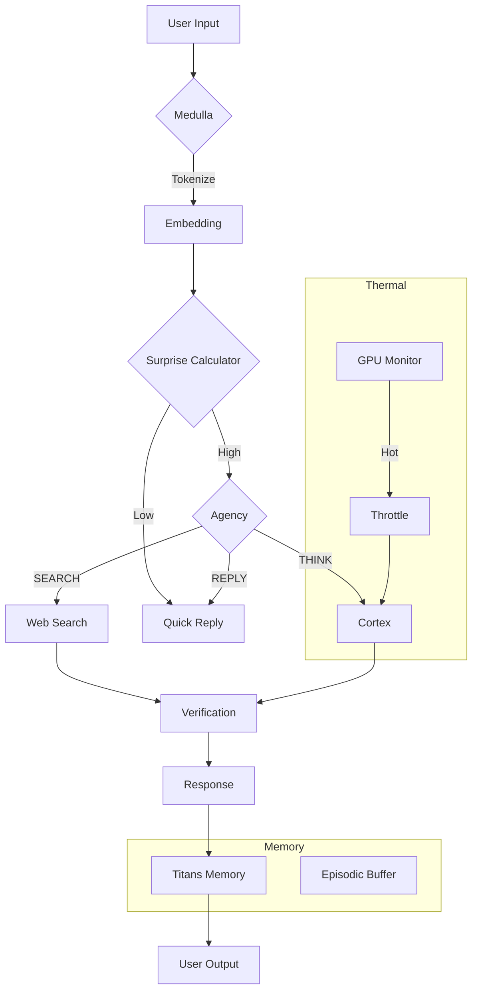

# AVA v4 Architecture

> **Note**: This document covers the v4.x architecture. For v3 Python-based architecture (deprecated), see the legacy section at the bottom.

## Overview

AVA v4 introduces a **unified Rust backend** that replaces the Python server. This provides:

- **Single binary distribution** - No Python dependencies required
- **Better performance** - Native code with async I/O
- **Smaller footprint** - ~50MB vs ~500MB for Python stack
- **Cross-platform** - Windows, macOS, Linux support

The core **Cortex-Medulla architecture** is preserved but now implemented in Rust.

## I. System Architecture (v4)

```
┌─────────────────────────────────────────────────────────────────────────┐
│                           USER INTERFACES                                │
│  ┌─────────────┐  ┌─────────────┐  ┌─────────────┐                      │
│  │  Desktop    │  │    TUI      │  │   Browser   │                      │
│  │   (Tauri)   │  │  (Textual)  │  │  (Next.js)  │                      │
│  └──────┬──────┘  └──────┬──────┘  └──────┬──────┘                      │
└─────────┼────────────────┼────────────────┼─────────────────────────────┘
          │                │                │
          ▼                ▼                ▼
┌─────────────────────────────────────────────────────────────────────────┐
│                         RUST BACKEND (unified)                           │
│  ┌────────────────────────────────────────────────────────────────────┐ │
│  │                      HTTP/WebSocket API (Axum)                     │ │
│  │   /chat  /health  /status  /settings  /ws  /chat/stream           │ │
│  └────────────────────────────────────────────────────────────────────┘ │
│                                   │                                      │
│  ┌────────────────────────────────┴───────────────────────────────────┐ │
│  │                      Cognitive Engine (cognitive.rs)                │ │
│  │  ┌─────────────┐                           ┌─────────────┐         │ │
│  │  │   MEDULLA   │  ◄─── Query Routing ───►  │   CORTEX    │         │ │
│  │  │ (fast path) │                           │ (deep path) │         │ │
│  │  │  gemma3:4b  │                           │ qwen2.5:32b │         │ │
│  │  └─────────────┘                           └─────────────┘         │ │
│  └────────────────────────────────────────────────────────────────────┘ │
│                                   │                                      │
│  ┌────────────────────────────────┴───────────────────────────────────┐ │
│  │                      Ollama Client (ollama.rs)                      │ │
│  │              HTTP client with connection pooling                    │ │
│  └────────────────────────────────────────────────────────────────────┘ │
└─────────────────────────────────────────────────────────────────────────┘
                                   │
                                   ▼
┌─────────────────────────────────────────────────────────────────────────┐
│                            OLLAMA SERVICE                                │
│                    (External LLM inference server)                       │
└─────────────────────────────────────────────────────────────────────────┘
```

## II. Rust Backend Structure

```
ui/src-tauri/src/
├── main.rs           # Application entry point
├── backend.rs        # Backend lifecycle management
├── commands.rs       # Tauri IPC commands
├── state.rs          # Shared application state
├── tray.rs           # System tray integration
├── bug_report.rs     # Bug reporting utilities
└── engine/
    ├── mod.rs        # Engine module exports
    ├── cognitive.rs  # Cortex-Medulla implementation
    ├── config.rs     # Configuration management
    ├── models.rs     # Data structures
    ├── ollama.rs     # Ollama client
    ├── routes.rs     # HTTP API endpoints
    ├── server.rs     # Axum server setup
    └── state.rs      # Engine state
```

## III. Key Components

### A. Cognitive Engine (`cognitive.rs`)

The unified Rust implementation of Cortex-Medulla:

```rust
pub struct CognitiveEngine {
    ollama: OllamaClient,        // LLM client
    config: EngineConfig,        // Runtime config
    conversation_history: Arc<RwLock<Vec<ConversationMessage>>>,
    total_requests: AtomicU64,   // Statistics
    cortex_requests: AtomicU64,
    current_state: Arc<RwLock<CognitiveStateInfo>>,
    active_model: Arc<RwLock<String>>,
}
```

**Query Routing Logic:**
1. Calculate query complexity (length, keywords, structure)
2. Route simple queries to Medulla (fast model)
3. Route complex queries to Cortex (deep model)
4. Support forced routing via `force_cortex` flag

### B. Ollama Client (`ollama.rs`)

High-performance async client for Ollama:

- Connection pooling via `reqwest`
- Configurable timeouts
- Health checking
- Model listing
- Chat and streaming endpoints

### C. HTTP API (`routes.rs`)

RESTful API using Axum framework:

| Endpoint | Method | Description |
|----------|--------|-------------|
| `/health` | GET | Health check with Ollama status |
| `/chat` | POST | Send message, get response |
| `/chat/stream` | POST | Server-sent events streaming |
| `/status` | GET | System status and statistics |
| `/info` | GET | Detailed system information |
| `/settings` | GET/POST | Configuration management |
| `/ws` | WebSocket | Real-time bidirectional chat |

## IV. User Interfaces

### Desktop Application (Tauri)

- Built with Tauri 1.6 + Next.js 14
- Single-window, system tray integration
- Auto-update support
- Native file dialogs

### Terminal UI (Textual)

- Python-based TUI using Textual
- Full keyboard navigation
- Conversation persistence (SQLite)
- Syntax highlighting for code blocks

### Browser Interface

- Next.js 14 with React 18
- Real-time streaming via WebSocket
- Framer Motion animations
- Responsive design

## V. Configuration

Configuration hierarchy:
1. `config/base_config.yaml` - Defaults
2. `config/user_config.yaml` - User overrides
3. Environment variables - Runtime overrides

Key settings:
```yaml
server:
  port: 8085
  host: "127.0.0.1"

cognitive:
  fast_model: "gemma3:4b"
  deep_model: "qwen2.5:32b"
  temperature: 0.7
  max_tokens: 2048
  cortex_threshold: 0.7

ollama:
  host: "http://localhost:11434"
  timeout: 120
```

## VI. Testing

### Rust Tests
```bash
cd ui/src-tauri
cargo test
```

Test modules:
- `tests/ollama_tests.rs` - Ollama client tests
- `tests/state_tests.rs` - AppState tests
- `tests/routes_tests.rs` - API endpoint tests
- `tests/models_tests.rs` - Data model tests

### Frontend Tests
```bash
cd ui
npm run lint
npm run type-check
```

## VII. Build & Distribution

### Windows Installer
```bash
cd ui
npm run tauri:build:release
```

Produces:
- MSI installer
- NSIS installer (.exe)
- Update signature for auto-updates

### Standalone Server
```bash
python scripts/build_server.py --clean
```

Produces `ava-server.exe` - standalone backend without UI.

---

## Legacy v3 Architecture

<details>
<summary>Click to expand v3 Python-based architecture (deprecated)</summary>

### Overview

AVA v3 implemented a **biomimetic architecture** inspired by the human nervous system:

- **Medulla** (brainstem): Always-on, fast reflexive processing
- **Cortex** (neocortex): Deep reasoning, activated on-demand
- **Hippocampus** (Titans): Long-term memory via test-time learning
- **Agency**: Autonomous behavior using Active Inference

## I. Core Challenge: 4GB VRAM Limitation

The system is optimized for NVIDIA RTX A2000 (4GB VRAM) through:

- **Dual-model architecture**: Fast small model (Medulla) + Large paged model (Cortex)
- **Layer-wise inference**: Cortex loads one layer at a time via AirLLM
- **Aggressive quantization**: 4-bit for Medulla, 1-bit BitNet where possible
- **Test-time learning**: Titans memory with fixed 200MB footprint

## II. System Flow

```
┌─────────────────────────────────────────────────────────────────────────┐
│                           USER INPUT                                     │
└─────────────────────────────────────────────────────────────────────────┘
                                    │
                                    ▼
┌─────────────────────────────────────────────────────────────────────────┐
│                        MEDULLA (Always Active)                          │
│  ┌─────────────┐  ┌─────────────┐  ┌─────────────┐  ┌─────────────┐    │
│  │ Tokenizer   │→ │ Mamba SSM   │→ │ Surprise    │→ │ Quick       │    │
│  │             │  │ (State)     │  │ Calculator  │  │ Response    │    │
│  └─────────────┘  └─────────────┘  └─────────────┘  └─────────────┘    │
│                                           │                              │
│                         High Surprise? ───┘                              │
└───────────────────────────────│──────────────────────────────────────────┘
                                │
                    ┌───────────┴───────────┐
                    │                       │
              Low Surprise             High Surprise
                    │                       │
                    ▼                       ▼
           ┌──────────────┐        ┌──────────────────────────────────────┐
           │ Quick Reply  │        │               CORTEX                 │
           │ (Medulla)    │        │  ┌─────────┐  ┌─────────┐  ┌─────┐  │
           └──────────────┘        │  │ AirLLM  │→ │ 70B     │→ │Deep │  │
                                   │  │ Loader  │  │ Model   │  │Reply│  │
                                   │  └─────────┘  └─────────┘  └─────┘  │
                                   └──────────────────────────────────────┘
```

## III. Component Details

### A. Medulla (`src/core/medulla.py`)

The Medulla is AVA's "fast brain" - always active and handling routine queries.

**Responsibilities:**
- Initial input processing
- Surprise calculation (embedding distance from known patterns)
- Quick response generation for low-complexity queries
- Routing decisions to Cortex

**Key Configuration:**
```python
class MedullaConfig:
    low_surprise_threshold: float = 0.3   # Below: Medulla responds
    high_surprise_threshold: float = 0.7  # Above: Cortex activates
    model_name: str = "gemma3:4b"         # Fast model
```

**Memory Usage:** ~800 MB resident

### B. Cortex (`src/core/cortex.py`)

The Cortex handles complex reasoning using large models on constrained hardware.

**Responsibilities:**
- Deep reasoning for complex queries
- Multi-step planning and problem decomposition
- Verification of factual claims
- Tool orchestration for complex tasks

**Key Features:**
- Layer-wise paging via AirLLM
- 70B+ models on 4GB VRAM
- ~3.3 seconds per token generation

**Memory Usage:** ~1.6 GB (paged on-demand)

### C. Bridge (`src/core/bridge.py`)

The Bridge connects Medulla and Cortex, enabling smooth transitions.

**Responsibilities:**
- Project Medulla hidden states to Cortex embedding space
- Maintain context continuity across components
- Enable efficient cross-attention

### D. Agency (`src/core/agency.py`)

The Agency module implements Active Inference for autonomous behavior.

**Available Policies:**
| Policy | Description | Effort Cost |
|--------|-------------|-------------|
| `PRIMARY_SEARCH` | Web search (default for questions) | 0.1 |
| `REFLEX_REPLY` | Quick Medulla response | 0.05 |
| `DEEP_THOUGHT` | Cortex reasoning | 0.3 |
| `WEB_BROWSE` | Extended web research | 0.2 |
| `SELF_MONITOR` | System introspection | 0.1 |
| `THERMAL_CHECK` | GPU temperature monitoring | 0.05 |
| `SYSTEM_COMMAND` | Execute commands (confirmed) | 0.4 |

**Free Energy Minimization:**
```python
G(π) = D_KL[Q(s|π) || P(s|C)] - E_Q[log P(o|s)]
     ≈ pragmatic_value + epistemic_value - effort_cost
```

### E. Titans Memory (`src/hippocampus/titans.py`)

Titans provides infinite context via test-time learning.

**Responsibilities:**
- Long-term memory storage
- Surprise-weighted gradient updates
- Semantic context retrieval

**Key Features:**
- 3-layer MLP learned during inference
- Fixed 200 MB footprint regardless of history length
- Automatic forgetting of low-importance memories

### F. System Orchestrator (`src/core/system.py`)

The main orchestrator that coordinates all components.

**Initialization Order:**
1. Titans Memory
2. Medulla
3. Cortex (lazy loaded)
4. Bridge
5. Agency
6. Thermal Monitor
7. Episodic Buffer

## IV. VRAM Management

AVA is optimized for 4GB VRAM GPUs:

```
Component           │ Resident │ Peak
────────────────────┼──────────┼─────────
System Overhead     │   300 MB │   300 MB
Medulla (Mamba)     │   800 MB │   800 MB
Titans Memory       │   200 MB │   200 MB
Bridge Adapter      │    50 MB │    50 MB
Cortex Buffer       │     0 MB │ 1,600 MB
────────────────────┼──────────┼─────────
Total               │ 1,350 MB │ 2,950 MB
Headroom            │ 2,650 MB │   446 MB
```

**Memory Strategies:**
- Medulla stays resident for fast response
- Cortex loads layer-by-layer (paging)
- Titans uses gradient checkpointing
- Aggressive garbage collection between Cortex calls

## V. Thermal Management

AVA monitors GPU temperature for self-preservation:

| Temperature | Action |
|-------------|--------|
| < 75°C | Normal operation |
| 75-80°C | Warning logged |
| 80-85°C | Throttle Cortex |
| > 85°C | Pause Cortex, Medulla only |

**Configuration:**
```yaml
thermal:
  max_gpu_power_percent: 15  # 10.5W on RTX A2000
  warning_temp_c: 75
  throttle_temp_c: 80
  pause_temp_c: 85
```

## VI. Search-First Paradigm

Web search is the DEFAULT action for informational queries.

**Trigger Words:**
- what, when, where, who, how, why
- define, explain, describe
- current, latest, recent

**Verification Process:**
1. Query parsed for question type
2. Minimum 3 sources retrieved
3. 70% agreement threshold for facts
4. Cross-reference with internal knowledge
5. Confidence score assigned

## VII. Request Flow Examples

### Simple Query (Medulla Path)
```
User: "What is the capital of France?"

1. Medulla receives input
2. Tokenization and embedding
3. Surprise calculated: 0.15 (low)
4. Agency selects: PRIMARY_SEARCH
5. Web search returns: Paris (100% agreement)
6. Quick response via Medulla
7. Titans stores with low surprise weight
```

### Complex Query (Cortex Path)
```
User: "Explain Gödel's incompleteness theorems philosophically"

1. Medulla receives input
2. Surprise calculated: 0.85 (high)
3. Agency selects: DEEP_THOUGHT
4. Cortex activated (layer-wise loading)
5. Multi-step reasoning (~45 seconds)
6. Response generated
7. Titans stores with high surprise weight
```

## VIII. API Endpoints

| Endpoint | Purpose | Component |
|----------|---------|-----------|
| `POST /chat` | General chat | Medulla → Agency → Response |
| `POST /think` | Force deep thought | Cortex directly |
| `POST /search` | Force search | Agency → Web |
| `GET /status` | System state | All components |
| `WS /ws` | Streaming | Medulla/Cortex |

## IX. Extension Points

### Adding New Policies

```python
# In src/core/agency.py
class CustomPolicy(Policy):
    name = "CUSTOM_ACTION"
    effort_cost = 0.2

    async def execute(self, context: Dict) -> PolicyResult:
        # Implementation
        pass

# Register
agency.register_policy(CustomPolicy())
```

### Adding New Tools

```python
# In src/ava/tools.py
class MyTool(Tool):
    name = "my_tool"
    description = "Does something useful"

    async def execute(self, args: Dict) -> ToolResult:
        # Implementation
        pass

# Register
tool_manager.register(MyTool())
```

## X. Performance Characteristics

| Metric | Medulla | Cortex |
|--------|---------|--------|
| First token latency | ~100ms | ~3.3s |
| Tokens per second | ~30 | ~0.3 |
| Memory footprint | 800 MB | 1.6 GB (paged) |
| Query complexity | Simple | Complex |
| Tool orchestration | Basic | Advanced |

## XI. System Diagram



## XII. Future Directions

- **Sparse Attention**: Further reduce Cortex memory via sparse patterns
- **Speculative Decoding**: Medulla drafts, Cortex verifies for speed
- **Multi-Modal**: Image understanding via CLIP integration
- **Federated Learning**: Privacy-preserving model updates
- **Edge Deployment**: ARM optimization for mobile devices
</details>